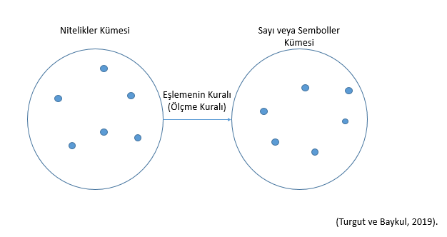
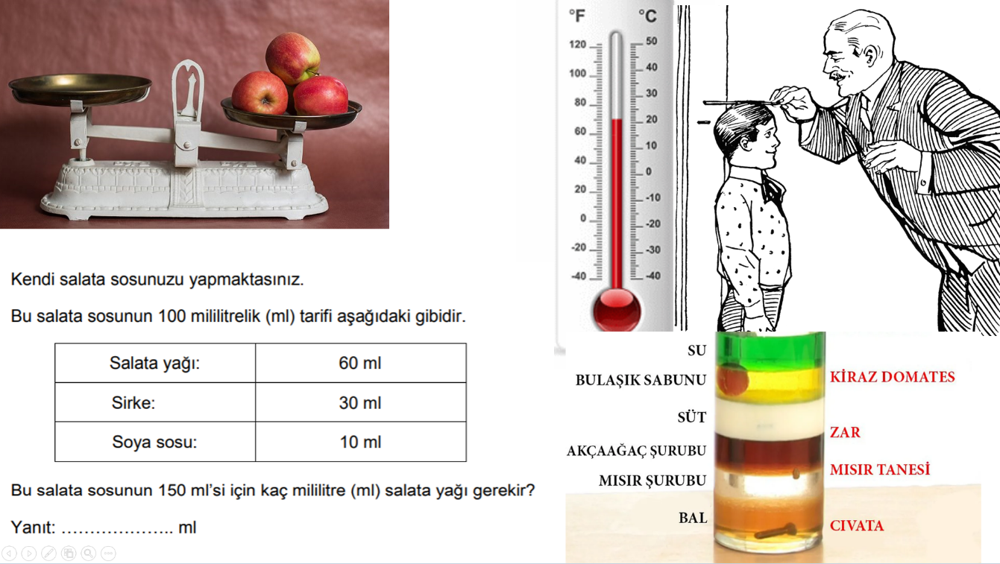
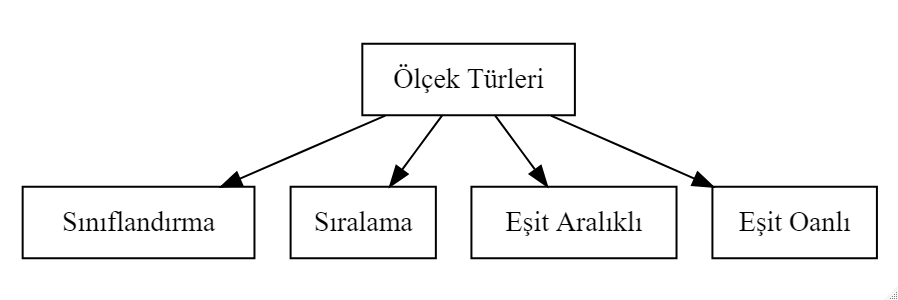

```{r child = "../setup.Rmd"}
```

```{r set-theme, include=FALSE}
library(xaringanthemer)
style_duo_accent(
  primary_color      = "#0F4C81", # pantone classic blue
  secondary_color    = "#B6CADA", # pantone baby blue
  header_font_google = google_font("Raleway"),
  text_font_google   = google_font("Raleway", "300", "300i"),
  code_font_google   = google_font("Source Code Pro"),
  text_font_size     = "30px"
)
```

```{r, include=FALSE}
advdate <- function(obj, adv) {
 tmon <- obj + 7*(adv-1)
 # tfri <- obj + 4 + 7*(adv-1)
 tmon <- format(tmon, format="%d/%m")
 # tfri <- format(tfri, format="%d/%m")
 zadv <- sprintf("%02d", adv)
 tmp <- paste("Hafta ",zadv,sep='',", ", tmon)
 return(tmp)
}

library(lubridate)
options(scipen=999)
library(tidyverse)
library(stevemisc)
mon <- ymd(20220207)
```

# Ölçmede Temel Kavramlar.huge[`r emo::ji("stats")`]

.hand[İçerik...]

-   Ölçme ve Ölçme Türleri Nedir?
-   Ölçüm Kuralı Nedir?
-   Ölçüm Nedir?
-   Ölçek Nedir?
-   Ölçek Türleri Nelerdir?
-   Ölçmede Hata
-   Ölçme Aracının Sahip Olması Gereken Özellikler
-   Değişken
-   Korelasyon
-   Güvenirlik ve Geçerlik

---
##   Ölçme ve Ölçme Türleri Nedir?

- **Ölçme**, birey ya da nesnelerin niteliklerinin **uygun araçlar** kullanılarak gözlenip gözlem sonuçlarının sembollerle ifade edilmesidir (Büyüköztürk vd., 2020). 

---
# Ölçme Nedir?

-   **Ölçme;** insanın varlığı ile var olan ve var olmaya devam edecek olan bir kavramdır.

--

-   Çünkü insanoğlunun her nasıl var olduğu kabul edilirse edilsin, var olduğu ilk andan itibaren çevresinde olan varlıkları gözlemlemek, algılamak ve buna göre tepkide bulunmak gibi bir mecburiyeti olmuştur.

--

-   Bu **gözlemleme** ve **algılama** işi de başlı başına bir ölçmedir. Bu sebeple ölçme kavramı insanın varlığı ile başlamakta ve hâlâ bu kavram insanla birlikte devam etmektedir.

---
## Ölçme Nedir?

Ölçmek bilmektir,

ölçülebileni ölçün,

ölçülemeyeni ölçülebilir hale getirin.

**Galileo Galilei**

```{r echo=FALSE, fig.align='center',out.width="30%"}
knitr::include_graphics("img/galileo.jpeg")
```

---
## Ölçme Nedir?

-   Ölçmek - measure
-   **me** kökünden helen birçok kelime bulunmakta  

--
-   **moon** (ay) - eskiden zamanı ölçmek için ayın pozisyonu kullanılırmış.  

--
-   **month** (ay) - moon kelimesinden gelir.  

--
-   **Monday** (pazartesi) - ay günü  

--
-   **Semester** - six ve month  

--
-   **menopause** (menapoz) - month (ay) ve pause (durmak) 

--
-   **meter**, **geometry**, **thermometer**, **dimension** 

--
-   **immense** (sonu olmayan büyük)  

---
## Ölçme Nedir?

-   Ölçmenin farklı bilim dallarında **farklı tanımlarını** görmek mümkündür.

--

-   Fakat, aynı zamanda aynı bilim dalı içinde de **farklı ölçme tanımları** görülebilmektedir.

--

-   Ölçmenin mantığı bir **ölçme aracı oluşturmak** için gerekli olan şartlarla ilgilidir.

--

-   Ölçme, burada kullanıldığı şekli ile, **karşılaştırma standardının** geliştirildiği sürece atfedilir.

---
## Ölçme Nedir?

-   Geniş anlamı ile **ölçme**, herhangi bir niteliğin **gözlenmesi** ve gözlem sonucunun **sayılarla** ya da başka **sembollerle** ifade edilmesidir.

--

-   Eğitim ve psikoloji açısından ele alındığında ölçme bireyler hakkında **bilgi toplama** sürecidir.

---
## Ölçme Nedir?

-   Ölçme **tanım kümesi** ile **değer kümesi** arasında bir fonksiyon olarak tanımlanabilir.

--

```{r echo=FALSE, fig.align='center',out.width="40%"}

```

--

-   Ölçmenin konusu, objelerin kendileri değil onların **dikkate alınan özellikleridir.**

---
## Niçin Ölçme Yapıyoruz?

-   Ölçme **değişimleri** farklılıkları ortaya koymak, belirlemek amacıyla yapılır.

--

-   Her nesne birçok farklı özelliğe sahiptir.

--

-   Bu bakımdan denilebilir ki ölçme bu **farklar** üzerine temellenmiştir. 

--

-   Eğer özellikler arasında fark olmasaydı o zaman ölçmeye gerek duyulmazdı.

---
# Ölçme Türleri

-   Özellikler arası **farkları** ortaya koymak ve bunları anlamlı hale getirerek bir **takım sembollerle** ifade etmeye ihtiyaç vardır.

--

-   Ancak bazı özellikler doğrudan gözlenebildiği halde bazı özellikler **doğrudan** gözlenmeye elverişli değildir. Bunların **dolaylı** olarak gözlenip ölçülmesi gerekir.

---
## Ölçme Türleri

```{r echo=FALSE, fig.align='center',out.width="75%"}

```

---
## Ölçme Türleri

-   Eğitimde bilişsel-duyuşsal alan davranışlarının ölçülmesi **dolaylı ölçmedir.**

--

-   Doğrudan ölçmenin geçerliği ve güvenirliği **yüksektir.**

---
## Ölçek Türleri

-   **Ölçek**, birinci anlamı sayı ve sembollerin anlamlarını ya da sayı ve sembollerin verilmesinde uyulması gereken **kurallar**

--

-   İkinci anlamı ise **birimle** bölmelenmiş ölçme aracını belirtmektedir (Turgut ve Baykul, 2019).

---
## Ölçek Türleri


```{r echo=FALSE, fig.align='center',out.width="75%"}

```

```{r eval=FALSE, include=FALSE}
my_graphviz <- grViz("digraph{
                     graph[rankdir = TB]

                     node[shape = rectangle, style = empty]  
                     A[label = 'Ölçek Türleri']

                     B[label = 'Sınıflandırma']

                     C[label = 'Sıralama']

                     D[label = 'Eşit Aralıklı']

                     E[label = 'Eşit Oanlı']

                     A -> B [color = black]

                     A -> C [color = black]

                     A -> D [color = black]
                     
                     A -> E [color = black]


                     

                     }")

my_graphviz
```

---
## Ölçek Türleri

| **İsim** | **Karar** |
|----------|-----------|
| Ekin     | Başarılı  |
| Arda     | Başarılı  |
| Demir    | Başarılı  |
| Ela      | Başarılı  |
| .        | .         |
| .        | .         |
| .        | .         |
| Ece      | Başarısız |
| Eel      | Başarısız |


---
## Ölçek Türleri

| **İsim** | **Başarı Sırası** | **Karar**   |
|----------|-------------------|-------------|
| Ekin     | 1\.               | Başarılı    |
| Arda     | 2\.               | Başarılı    |
| Demir    | 3\.               | Başarılı    |
| Ela      | 4\.               | Başarılı    |
| .        | .                 | .           |
|          |                   |             |
| .        | .                 | .           |
|          |                   |             |
| .        | .                 | .           |
| Ece      | 23\.              | Başarısız   |
| Emel     | 24.               | Başarısız   |

---
## Ölçek Türleri


| **İsim** | **Not** | **Başarı Sırası** | **Karar**   |
|----------|---------|-------------------|-------------|
| Ekin     | 10      | 1\.               | Başarılı    |
| Arda     | 9       | 2\.               | Başarılı    |
| Demir    | 8       | 3\.               | Başarılı    |
| Ela      | 7       | 4\.               | Başarılı    |
| .        | .       | .                 | .           |
| .        | .       | .                 | .           |
| .        | .       | .                 | .           |
| Ece      | 3       | 23\.              | Başarısız   |
| Emel     | 2       | 24.               | Başarısız   |

---
## Ölçek Türleri


| **İsim** | **Doğru Sayısı** | **Not** | **Başarı Sırası** | **Karar**   |
|----------|------------------|---------|-------------------|-------------|
| Ekin     | 10               | 10      | 1.                | Başarılı    |
| Arda     | 9                | 9       | 2.                | Başarılı    |
| Demir    | 8                | 8       | 3.                | Başarılı    |
| Ela      | 7                | 7       | 4.                | Başarılı    |
| .        | .                | .       | .                 | .           |
| .        | .                | .       | .                 | .           |
| .        | .                | .       | .                 | .           |
| Ece      | 3                | 3       | 23.               | Başarısız   |
| Emel     | 2                | 2       | 24.               | Başarısız   |

---
## Ölçek Türleri

|               | **Zeynep** | **Aras** | **Elif** | **Deniz** |
|---------------|------------|----------|----------|-----------|
| Eşit Oranlı   | 185 cm     | 165 cm   | 100 cm   | 85 cm     |
| Eşit Aralıklı | 85         | 65       | 45       | 15        |
| Sıralama      | 1\.        | 2\.      | 3\.      | 4\.       |
| Sınıflama     | Uzun       | Uzun     | Kısa     | Kısa      |

---
## Ölçek Türleri

| **Ölçek**   | **Başlangıç Noktası** | **Birimi** | **Sıra** | **Fark** | **Oran** |
|-------------|-----------------------|------------|----------|----------|----------|
| Sınıflama   | Yok                   | Yok        | \-       | \-       | \-       |
| Sıralama    | Değişken              | Değişken   | Var      | \-       | \-       |
| Eşit Aralık | Keyfi                 | Keyfi      | Var      | Var      | \-       |
| Eşit Oranlı | Mutlak                | Mutlak     | Var      | Var      | Var      |

---
# Ölçmede Hata

- **Güvenirlik** ve **geçerlik** kavramlarının temel mantığı ölçme sonuçları ve bu sonuçlar kullanılarak yapılan değerlendirmelerin **ne kadar az hatalı** olduğunun belirlenmesi üzerinde kurulmuştur.

---
## Ölçmede Hata

-   Ölçülen özelliğin gerçek değeri ile gözlenen değeri arasındaki fark **hatadır.**

--

-   Bir test veya ölçekten elde edilen puanlar ne zaman hatalıdır?

    -   **Hemen her zaman!**

--

-   Gerek fiziksel bilimlerde gerekse sosyal bilimlerde ölçüm sonuçlarına mutlaka bir miktar **hata** karışır ve bu hatanın miktarı kesin olarak bilinemez.

--

-   Hatayı ortadan kaldırmak mümkün olmasa da hata kaynaklarını belirleyip **en aza** indirmek mümkün olabilir.

---
## Ölçmede Hata

-   Ölçmeye karışan çeşitli hatalar nedeniyle gözlenen bir özelliğin gerçek değeri doğrudan elde edilemez, ölçme sonucu gözlenen puanlar yardımıyla kestirilmeye çalışılır.

--

-   **Hatanın miktarı arttıkça** elde edilen puan bireyin **gerçek puanından** (gerçek başarı, yetenek veya bilgi düzeyi) uzaklaşır.

---
## Ölçmede Hata

-   Elde edilen puanın yönü iki taraflı olabilir yani olması gerekenden **fazla** veya **az** olabilir.

--

-   Hataya sebep olan etkenlerin farkında olmak, ölçme işlemine karışan **hataları azaltmaya** yardımcı olur.

--

-   Ölçümlerdeki hatanın mümkün olduğunca **azaltılması**, ölçülen özelliğin miktarı hakkında doğru bilgi edinebilmek ve bunun sonucunda doğru kararlar verebilmek açısından önemlidir.

---
## Ölçmede Hata

-   Ölçmede hataların kestirilebilmesi için ölçmelerin tekrarı gereklidir.

--

-   Her öğrenci için tek bir ölçüm sonucu olsaydı her ölçmenin sonucu kendisine eşit olacak ve ortalamadan sapmalar söz konusu olmayacaktı.

--

-   Bu nedenle eğitimde **hata miktarının** ve **güvenirliğin** kestirilebilmesi için tekrarlı ölçümlere ya da ölçümlerin tekrarı sayılabilecek yöntemlere ihtiyaç vardır.

---
## Ölçmede Hata

-   **Ölçme aracından** kaynaklanan hatalar

--

-   **Ölçmeyi yapan** bireyden kaynaklanan hatalar

--

-   **Ölçülen bireyden** kaynaklanan hatalar

-   Ölçmenin yapıldığı **ortamından** kaynaklanan hatalar

---
## Hata Türleri

```{r echo=FALSE, message=FALSE, warning=FALSE,include=FALSE}
library(DiagrammeR)
library(DiagrammeRsvg) 
library(rsvg) 

hataturleri <- grViz("digraph{
                     graph[rankdir = TB]
                     node[shape = rectangle, style = empty] 
                     A[label = 'Hata Türleri']
                     B[label = 'Sabit']
                     C[label = 'Sistematik']
                     D[label = 'Tesadüfi']
                     edge[color = red]
                     A -> B [color = black]
                     A -> C [color = black]
                     A -> D [color = black]
                     }")

hataturleri
```


---
## Ölçmede Hata

-   **Sabit ve sistematik hata**larda ölçme sonuçlarına karışan hatanın miktarı, yönü ve kaynağı bellidir. Bu sebeple bu tür hataların ölçme sonuçlarına karışmasını **engellemek ya da düzeltmek nispeten daha kolaydır.**

--

-   Ölçme sonuçlarına bazen pozitif, bazen de negatif önde karışabilirler. Bu nedenle **tesadüfi hatalar kontrol edilemez.**

---
## Güvenirlik

- Ölçme sonuçlarının **tesadüfi hatalardan arınıklığının** bir ölçüsüdür (Turgut, 1990; akt: Büyüköztürk vd., 2020).

--

  - Duyarlılık

--

  - Tutarlılık

--
  - Kararlılık


---

.center[
## Korelasyon

]

.three-column[
```{r echo=FALSE, message=FALSE, warning=FALSE}
kor0 <- ggplot(mtcars, aes(x=drat, y=qsec)) +
  geom_point() +
  labs( x="Kahvaltıda tüketilen ekmek miktarı", y = "Test Puanı")+
  theme_bw()
kor0
```
]

--

.three-column[
```{r echo=FALSE, message=FALSE, warning=FALSE}
kor0 + geom_smooth(method=lm, se=FALSE)
```
]

--

.three-column[
```{r echo=FALSE, message=FALSE, warning=FALSE}
kor0+ geom_smooth(method=lm, se=FALSE) +
  stat_ellipse()
kor0deger <- round(cor(mtcars$drat, mtcars$qsec), 3)
```
]

--

.alert[Kahvaltıda tüketilen ekmek miktarı ve test puanı arasındaki korelasyon `r kor0deger`]


---
.center[
## Korelasyon

]

.three-column[
```{r echo=FALSE, message=FALSE, warning=FALSE}
mtcars$new  <- mtcars$gear*60 + sample(-15:15,32,replace = TRUE)
kororta <- ggplot(mtcars, aes(x=new, y=mpg)) +
  geom_point() +
  labs( x="Sosyal Faliyetlere Ayrılan Zaman (dk)", y = "Test Puanı")+
  theme_bw()
kororta
```
]

--

.three-column[
```{r echo=FALSE, message=FALSE, warning=FALSE}
kororta + geom_smooth(method=lm, se=FALSE)
```
]

--

.three-column[
```{r echo=FALSE, message=FALSE, warning=FALSE}
kororta+ geom_smooth(method=lm, se=FALSE) +
  stat_ellipse()
korortadeger <- round(cor(mtcars$mpg, mtcars$new ), 3)
```
]

.alert[Sosyal faliyetlere ayrılan zaman ve test puanı arasındaki korelasyon `r korortadeger`]


---

.center[
## Korelasyon

]


.three-column[
```{r echo=FALSE, message=FALSE, warning=FALSE}
set.seed(42)
mtcars$dispnew  <- mtcars$disp /2 + 60 + sample(-5:5, 32, replace = TRUE)
koryuksek <- ggplot(mtcars, aes(x=dispnew, y=disp)) +
  geom_point() +
  labs( x="Ders Dışı Öğrenmeye Ayrılan Zaman (dk)", y = "Test Puanı")+
  theme_bw()
koryuksek
```
]

--

.three-column[
```{r echo=FALSE, message=FALSE, warning=FALSE}
koryuksek + geom_smooth(method=lm, se=FALSE)
```
]

--

.three-column[
```{r echo=FALSE, message=FALSE, warning=FALSE}
koryuksek+ geom_smooth(method=lm, se=FALSE) +
  stat_ellipse()
koryuksekdeger <- round(cor(mtcars$disp, mtcars$dispnew ), 3)
```
]

.alert[Ders dışı öğrenmeye ayrılan zaman ve test puanı arasındaki korelasyon `r koryuksekdeger`]

---


`r emo::ji('link')` [Korelasyon hesaplamaları](https://docs.google.com/spreadsheets/d/1Ha0v62qYpwXhSo-7bx_-hvh_KRmYYic3/edit?usp=sharing&ouid=117160923198825369445&rtpof=true&sd=true)<br>
---
##   Güvenirlik 

- **Test-Tekrar Test Yöntemi** 
- **Eşdeğer (Paralel, Alternatif) Formlar Yöntemi**,

- **İç tutarlılık Yöntemleri**
  - Testi Yarılama/Eşdeğer Yarılar
  - KR-20, KR-21
  - Cronbach Alpha
  
- **Değerlendirmeciler Arası Tutarlılık**
  - Yüzde Uyumu
  - Sınıf içi Korelasyon 
  - Kappa Yöntemi
  
(Gliner, Morgan ve Leech, 2009/2015; akt: Ocak, 2019)

---
## Test-Tekrar Test Yöntemi 

- İki uygulamadan elde edilen **puanlar arasındaki korelasyon**,

--

- 1’e yaklaşırsa puanlar birbirine yaklaşır, 0’a yaklaşırsa puanlar birbirinden uzaklaşır,

--

- Kararlılık katsayısı,

--

- Yüksek korelasyon zamana bağlı olarak değişim olmadığını gösterir,
- İki uygulama arasındaki zaman .... 

---
## Eşdeğer (Paralel, Alternatif) Formlar Yöntemi

- Aynı özelliği ölçmeyi amaçlayan iki test,

--

- İki test uygulaması kısa aralıklarla yapılmalı,

--

- Eşdeğerlik katsayısı,

--

- Grup ikiye ayrılarak uygulama yapılabilir,


---
## İç tutarlılık Yöntemleri /Testi Yarılama(Eşdeğer Yarılar)


- Test iki eş paçaya ayrılarak parçalar arası korelasyon yöntemi
- Pearson korelasyonu, Spearman-Brown veya Rulon
- İki ayırlama işlemi; hesaplanır,
  - Tek-çift numalara,
  - Tesadüfi seçim,
  - Hedef davranışlar,
  - Madde güçlükleri


---
## İç tutarlılık Yöntemleri /KR-20,KR-21; Cronbach alpha

- KR-20, KR-21: 0 – 1 puanlamanın yapıldığı ölçme araçları için hesaplanır.

--

- Cronbach alpha: Derecelendirme ölçeği (ör: 1-5) kullanılan ölçme araçları için hesaplanır. 

---
## Değerlendirmeciler Arası Tutarlılık

- Bireylerin ölçülen özelliğe ne derecede sahip olduğuna ilişkin **iki ya da daha** fazla bağımsız gözlemcinin/puanlayıcının verdiği puanların güvenirliğini incelemede kullanılır. 

--

- Puanlar arası **tutarlılık** varsa, verilecek puanlar, iki değerlendirmecinin puanlarının ortalaması alınarak verilebilir. 

---
## Güvenirliği Etkileyen Faktörler

- Ölçme aracına ilişkin faktörler:

--

- Testin uzunluğu

--

- Uygulama yönergesi ve maddelerin ifadesi

--

- Maddelerin homojenliği

--

- Puanlamadaki nesnellik

--

- Testi alan birey ve gruba bağlı faktörler

--

- Uygulama koşulları ve zaman

---
## Geçerlik

-   Bir ölçme aracının ölçülmek **istenen özelliği ölçüp ölçmediği hakkında** karar vermek için birden fazla kanıta ihtiyaç vardır.

--

-   Bu yönüyle **geçerlik**, ölçme aracını kullanan kişinin ölçme sonuçlarından çıkarılacak yorumları ve ölçme sonuçlarının kullanımını desteklemek için topladığı **kanıtlar** olarak tanımlanabilir.

--

-   Bu açıdan bakıldığında, geçerlik tek bir katsayıyla ifade edilmek yerine testin geliştirilme ve kullanılış **amacına hizmet eden kanıtların toplanmasıyla** yorumlanabilir

---
## Geçerlik

-   Geçerli bir ölçme aracı öğrencilere ne bildiklerini gösterme şansı veren ölçme aracıdır.

1.  Hangi konular teste/sınava dahil olmalı?

--

2.  Hangi tip maddeler kullanılmalı?

--

3.  Sınavda kac madde yer almalı?

--

4.  Hazırlanan sınavdan elde edilecek puanlar benzer amaçla hazırlanmış sınavlarla uyumlu?

--

5.  Hazırlanan sınavdan elde edilecek puan gelecekteki başarıyı kestirmede ne kadar başarılı?

---
## Geçerlik

Ölçme aracıyla **ölçülmek istenen** özelliğin diğer özelliklere **karıştırılmadan** ne derece doğru ölçtüğü ile ilgilidir. 

- Kapsam Geçerliği

--

- Ölçüte Dayalı Geçerlik

--

  - Eşzaman geçerliği

--

  - Yordama geçerliği

--

- Yapı Geçerliği

---
## Kapsam Geçerliği

- Ölçülmesi hedeflenen davranışlar evreninin, ölçme aracında yer alan sorularla (davranışlar örneklemi) iyi bir şekilde temsil edilmesi,

  - Uzman görüşüne başvurmak,
  
  - Belirtke tablosu 

---
## Ölçüte Dayalı Geçerlik

- Geçerliği ve güvenilirliği daha önceden belirlenmiş bir ölçüt 

--

- **Eşzaman geçerliği:** Aynı ya da yakın zamanda ölçüt alınan ölçme aracının uygulanması

--

- **Yordama geçerliği:** Ölçüt alınan ölçme sonuçları ileri bir zaman diliminde elde edilir

---
## YAPI GEÇERLİĞİ

- Ölçme aracıyla ölçülmek istenilen yapının ne derecede ölçülebildiği ile ilgilenilir,

--

- İlgili, tutum, güdü vb. psikolojik yapıların ölçülmesi,


<!-- ### SINIFLAMA ÖLÇEĞİ -->

<!-- **Homojen gruplar,** -->
<!-- **Miktar göstermez,** -->
<!-- Frekans, yüzde, -->
<!-- Saç rengi, göz rengi, cinsiyet  -->
<!-- ### SIRALAMA ÖLÇEĞİ -->
<!-- Sıralar arasında **eşit bir birim yok**, -->
<!-- **A>B**, **A<B** şeklinde yorumlar yapılabilir, -->
<!-- Futbol ligi sıralaması, öğrencilerin başarı puanlarına göre sıralanması, -->
<!-- Ortanca, yüzdelik, çeyrek sapma ....  -->
<!-- ### ARALIK ÖLÇEĞİ -->
<!-- **Eşit ölçme birimi vardır,** -->
<!-- 2 ve 3 arasındaki fark ile 3 ve 4 arasındaki fark eşittir, -->
<!-- **Keyfi başlangıç noktası,** -->
<!-- Sıfır **yokluk** demek **değildir**, -->
<!-- Sıcaklık, yetenek, ilgi, tutum, -->
<!-- Ortalama, standart sapma, pearson korelasyon, t-testi ... -->
<!-- ### ORAN ÖLÇEĞİ -->
<!-- Gerçek miktarı ölçer, **ölçme birimi eşit**, -->
<!-- Gerçek sıfır, -->
<!-- Kardeş sayısı, boy, ağırlık , -->
<!-- Geormetrik ortalama,.... -->


---
## Yararlanılan Kaynaklar
- Aybek, E. C. (2019). Verilerin çevrimiçi toplanması, saklanması ve etik. K. Yılmaz ve R. S. Arık (Edt.) *Bilim ve araştırma etiği* içinde (2-11). Ankara: Pegema Yayıncılık. 
- Büyüköztürk, Ş., Çakmak E. K., Akgün, Ö. E., Karadeniz, Ş., Demirel, F. (2020). *Eğitimde bilimsel araştırma yöntemleri* (28. Baskı), Ankara: Pegema Yayıncılık. 
- Frankel, J. R.; Wallen, N. E. &  Hyun, H. H. (2012). *How to design and evaluate research in education* (8th Edition). New York: McGraw Hill International.
- Ocak, G. (2019). Bilimsel araştırmalarda kullanılan veri toplama yolları. G. Ocak (Edt.), *Eğitimde bilimsel araştırma yöntemleri* içinde (2-61). Ankara: Pegema Yayıncılık. 

