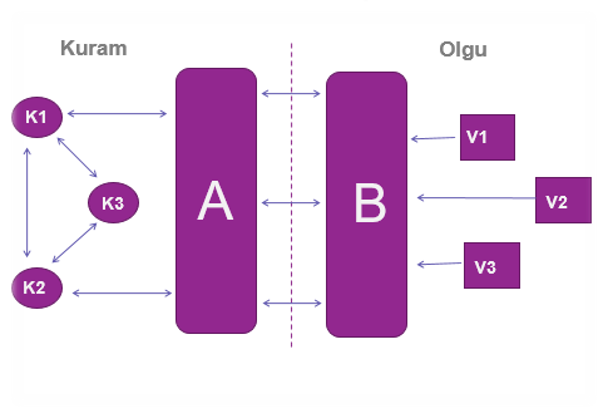
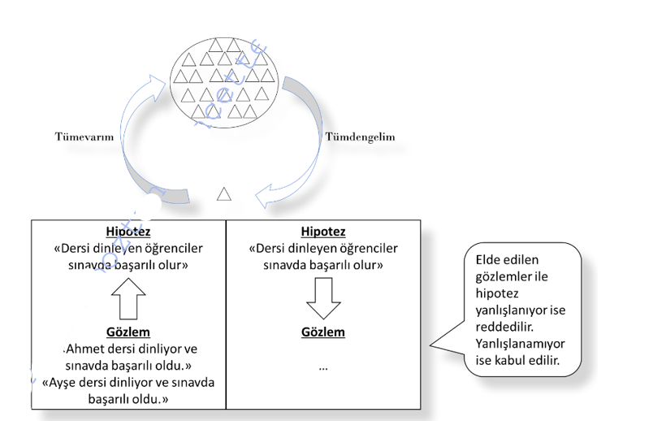
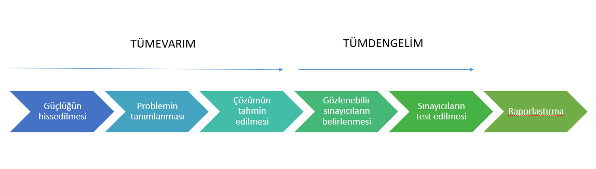
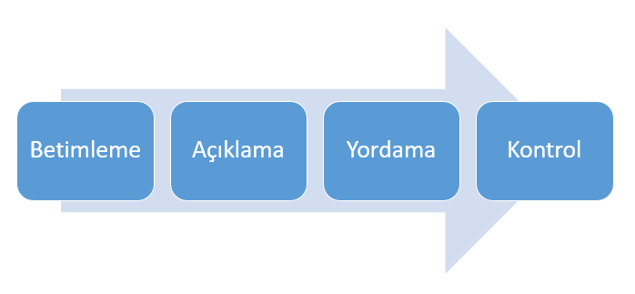

```{r child = "../setup.Rmd"}
```

```{r set-theme, include=FALSE}
library(emoji)
library(xaringanthemer)
style_duo_accent(
  primary_color      = "#0F4C81", # pantone classic blue
  secondary_color    = "#B6CADA", # pantone baby blue
  header_font_google = google_font("Raleway"),
  text_font_google   = google_font("Raleway", "300", "300i"),
  code_font_google   = google_font("Source Code Pro"),
  text_font_size     = "30px"
)
```

```{r, include=FALSE}
advdate <- function(obj, adv) {
 tmon <- obj + 7*(adv-1)
 # tfri <- obj + 4 + 7*(adv-1)
 tmon <- format(tmon, format="%d/%m")
 # tfri <- format(tfri, format="%d/%m")
 zadv <- sprintf("%02d", adv)
 tmp <- paste("Hafta ",zadv,sep='',", ", tmon)
 return(tmp)
}

library(lubridate)
options(scipen=999)
library(tidyverse)
library(stevemisc)
mon <- ymd(20220207)
```

# Bilimsel Araştırmaya Giriş.huge[`r emo::ji("stats")`]

.hand[İçerik...]

-   Bilgi Nedir? 
-   Bilgi Edinme Yolları Nelerdir?
-   Bilim Nedir?
-   Bilimin Temel İşlevleri
-   Bilimin Başlıca Özellikleri
-   Bilimsel Yöntem
-   Bilimsel Araştırmalarda Bulunması Gerekenler
---
##   Bilgi Nedir? 

**Türk Dil Kurumu (2020);**

- İnsan aklının erebileceği olgu, gerçek ve ilkelerin bütünü,

- Öğrenme, araştırma veya gözlem yoluyla elde edilen gerçek,

- İnsan zekasının çalışması sonucu ortaya çıkan düşünce ürünü,  

- Genel olarak ve ilk sezi durumunda zihnin kavradığı temel düşünceler,

- Kurallardan yararlanarak kişinin veriye yönelttiği anlam 

---
## Bilginin Kaynağı

- İnsanlar sürekli olarak kendilerini ve çevrelerini aydınlatma, tanıma, olay ve oluşumları açıklama ve karşılaştıkları problemlere güvenilir çözümler arama uğraşı içindedirler (Karasar, 2005). 

- Günlük ve profesyonel yasantımızda kararlar almak için sık sık bilgi arayışına gireriz. 

- Bazı kararlar çok, çok önemli, diğerleri oldukça önemsiz

- Bazı kararlar çok resmi, kasıtlı bir şekilde, diğerleri ise oldukça sezgilerimize dayalı bir şekilde alınır.


---

## Bilgi Edinme Yolları

- Bugün hava çok sıcak.

- Bugün hava sıcaklığı 40 derece.

---
## Bilgi Edinme Yolları

- Hissetme (Duyusal Deneyim)

- Bilgiyi başkalarıyla paylaşma (Görüş Birliği) 

- Bir uzmanın size bir şey söylemesi (Uzman Görüşü)

- Mantıksal çözümleme (Mantık)

- Bilim (Bilimsel Yöntem)

    -Bilimsel yöntemle elde edilmiş bilgiler aslında her an yanlış oldukları ortaya çıkabilecek geçici doğrular mertebisindedir.

---
## Bilgi Edinme Yolları

- Bilgiye ulaşmanın en doğru ve güvenilir yolu bilimsel yöntemdir.

- Bilimsel yöntem; geçerlik ölçüsü güvenilir veriler olan bir anlama, bulma ve doğrulama yöntemidir. 

- Bilimsel yöntemle elde edilmiş bilgiler aslında her an yanlış oldukları ortaya çıkabilecek geçici doğrular mertebisindedir.

---
## Bilim Nedir?

- Bu soruya hepimizin birleştiği bir yanıt henüz verilememiştir. Bunun başlıca nedenleri

- Bilimin sürekli değişen ve gelişen bir etkinlik olması,
  
  - İnceleme konusu ve yöntemi bakımından çok yönlü ve sınırlarının da kesin olmamasından kaynaklanmaktadır.

---
## Bilim Nedir?

- Bilim **sistemli** ve **mantıksal bilgiler** bütünüdür.

- **Gerçeği** ya da **doğruyu** arama etkinliğidir.
- İnsanın deneyim ve yaşantısını betimleme, yaratma ve anlama yöntemidir (Lindsay).

- Bilim, **üzerinde herkesin birleşebileceği** yargıları konu alan bir çalışmadır (Campbell).

- Bilime dayalı problem çözmenin en belirgin özelliği, çözümün genel, **güvenilir** ve insanlarca bilinen en **geçerli** verilere dayalı olmasıdır.

---
## Bilim Nedir?


- Bilim, her türlü düzenden yoksun duyu verileri (algılar) ile mantıksal olarak düzenli düşünme arasında uygunluk sağlama çabasıdır (Einstein).

- Bilim, gözlem ve gözleme dayalı akıl yürütme yoluyla önce dünyaya ilişkin olguları, sonra bu olguları birbirine bağlayan yasaları bulma çabasıdır (Russell).

---
## Bilim Nedir?

- Bilim, **denetimli gözlem** ve **gözlem sonuçlarına** dayalı mantıksal düşünme yolundan giderek olguları açıklama gücü taşıyan **hipotezler** (açıklayıcı genellemeler) bulma ve **bunları doğrulama** yöntemidir (Yıldırım).

- Bilim, evreni, toplumu ve insanı araştırma konusu yapan **gözleme**, **deneye ve akla** dayanarak yöntemli bir şekilde elde ettiği **doğrulanabilir** bilgilerdir (Büyüköztürk vd., 2008). 

---
## Bilim Nedir?

```{r echo=FALSE, fig.align='center',out.width="75%"}

```

---
## Bilimsel Yöntem

- Bacon tarafından geliştirilen `r emo::ji('right')` Tümevarım Empirizm (deneycilik), gerçek bilgiye duyular sayesinde ve tümevarım aracılığıyla ulaşılabileceğini savunur.

- Aristo tarafından kavramsallaştırılan `r emo::ji('right')`  Tümdengelim Rasyonalizm (akılcılık), bilginin asıl kaynağının akıl olduğunu ve tümdengelim aracılığıyla elde edilebileceğini savunur.
süreçlerinin sentezidir. 
	
- Pragmatizm (faydacılık)

---
## Bilimsel Yöntem

```{r echo=FALSE, fig.align='center',out.width="50%"}

```
(Şimşek,2019)

---
## Bilimsel Yöntem

```{r echo=FALSE, fig.align='center',out.width="75%"}

```

Karasar, 2009’dan Şimşek (2019) tarafından uyarlanmıştır. 

---
## Bilimsel Yöntem

- **Tümevarım:** Dış dünyada gözlenen olgulardan yola çıkılarak bu olgulara ilişkin bir kuram oluşturulması
Kuram, olguları tanımlayan; 
en az iki olgu arasında ilişki kuran; 
olgulara ilişkin tanımlar, 
varsayımlar, ilkeler ve genel önermeler (genellemeler) içeren bir yapıdır. 

- Bilimsel yöntemin bu aşamasında, tek tek gözlenen olaylardan, 
bu olayların tümünü olgusal olarak açıklayan ortak ve temel bir ilkeye ulaşma çabası vardır.

---
## Bilimsel Yöntem

- **Tümdengelim:** Birinci aşamada ortaya konan kuramın çıkarsamalarının oluşturulması
Bu aşamada, geliştirilen kurama göre, belirli koşullarda hangi durumlarla karşılaşılabileceğine dair tahminler (hipotezler) ortaya konur. 
- Bu süreçte genelden özele, bütünden parçaya doğru ilerlenir.
- Olgular dünyasına dönüş. Bu aşamada, ikinci aşamada ortaya atılan hipotezlerin doğru olup olmadığı sınanır. 

---
## BİLİMİN BAŞLICA ÖZELLİKLERİ

- **Olgusaldır;** Tek tek olaylarla değil olgularla ilgilenir.

- **Seçicidir;** Madde ile ilgilenir. Metafizik bilimin konusu değildir.

- **Objektiftir;** Öznellikten uzak bir şekilde olabildiğince yansız yürütülür. 

- **Akılcıdır;** Tutarlı ve akla yatkın bilgiler üretir.

- **Eleştireldir;** Mevcut bilimsel bilgilere eleştirel bir yaklaşım sergiler.

- **Birikimlidir;** Yeni bilimsel araştırmalar için mevcut bilgiler ön bilgi oluşturur. 

- **Evrenseldir;** Aynı koşullar altında benzer sonuçlar üretecek niteliktedir (Şimşek, 2019).

---
## BİLİMİN TEMEL İŞLEVLERİ	

```{r echo=FALSE, fig.align='center',out.width="75%"}

```

---
## BİLİMİN TEMEL İŞLEVLERİ	

- Nedir? `r emo::ji('right')` Bir nesnenin ya da olayın tasvir edilmesidir. `r emo::ji('right')` BETİMLEME

- Nasıl? `r emo::ji('right')` Bir nesnenin ya da olayın nasıl oluştuğu, çevresini nasıl etkilediği ya da çevresinden nasıl etkilendiğinin tanımlanmasıdır. `r emo::ji('right')`AÇIKLAMA

- Açıklayıcı bilgilere sahip olan bir nesne ya da olayla ilgili ileriye dönük kestirimlerin yapılmasıdır. `r emo::ji('right')` YORDAMA

- Bir nesne ya da olay ile ilgili istenilen yönde manipülasyonların gerçekleştirilmesidir. `r emo::ji('right')` KONTROL

---
## Araştırma Nedir?

- Araştırma, **sorunlara** güvenilir çözümler aramak amacıyla, **planlı** ve **sistemli** olarak, **verilerin toplanması**, **çözümlenmesi**, **yorumlanarak değerlendirilmesi** ve **rapor edilmesi** sürecidir (Karasar, 1991; akt: Büyüköztürk vd., 2020). 


---
## Bilimsel Araştırma

- Araştırma herhangi bir konu ile ilgili durum, olgu ve ilkelerin sistemli, dikkatli ve sabırlı bir şekilde **toplanması** ve **incelenmesi**dir. 
- Bilimsel araştırma, **bilimsel yöntemi** kullanarak belli olgu ve ilkeler hakkında bilgi toplamak; olgu ve ilkeleri kabul etmek ya da reddetmek için kanıtlar toplamak amacıyla yürütülen bir **süreçtir.** 
---
## Bilimsel Yöntemin Basamakları 

1. Güçlüğün sezilmesi - Problemin hissedilmesi

2. Problemin tanımlanması / daraltılması

3. Çözümün tahmin edilmesi - Bazı çözüm yollarının ortaya konması

4. Gözlenebilir sınayıcıların belirlenmesi; hipotezler (denenceler) veya sorular olarak ifade edilmesi

5. Deneme ve değerlendirmelerin yapılması - Hipotezlerin test edilmesi

6. Raporlaştırılması

---

.pull-left[

## Bilimsel Araştırma

- Somut bir amaç olmaksızın sadece bilgilerin toplanması,

- Yorumlama olmaksınız bilgilerin tasnif edilmesi

- Bir ürün ya da fikrin ne derece ilgi gördüğü tespit etmek için kullanılan bir terim **değildir.**
]
.pull-right[

## Bilimsel Araştırma

- Yeni bir şey öğrenmek için somut bir amaç ile yapılır.

- Verilerin sistemleri bir şekilde toplanması 

- Toplanan verilerin ne anlama geldiğinin uygun yöntemlerle analiz edilerek yorumlanması**dır.**
]

---
## Bilimsel Araştırmanının Temelleri


Bilimsel Araştırma 

-  Geçerli bir soruna dayanmalıdır

- Kuramsal yapısı, değişkenleri ve değişkenler arasındaki muhtemel ilişkiler belirlenmelidir.

- Araştırma yöntemi tespit edilmelidir.
 
- Araştırma yöntemine uygun örneklem ve veri toplama araçları belirlenerek veri toplanmalıdır.

- Toplanan verilerin çeşitli analiz teknikleri ile analiz edilerek yorumlanması ve sonuçların raporlanarak ilgili bilim caiması ile paylaşılması gerekir. 

---
## Bilimsel Araştırmanının Amaçları

- Olguların **betimlenmesi**, **düzenlenmesi**, **sınıflandırılması**

- Olgular arasındaki **ilişkilerin ortaya çıkarılması** 

- Olguları **anlama ve açıklama**

- Olayların **önceden tahmini ve kontrolü**

---
## Kaynaklar

- Bedir Erişti, S. D. (2013). Bilimsel Araştırma Yöntemleri. A. A. Kurt (Edt.), *Bilimsel Araştırma Yöntemleri* içinde (1-17). Eskişehir: Anadolu Üniversitesi Yayınları
- Büyüköztürk, Ş., Çakmak E. K., Akgün, Ö. E., Karadeniz, Ş., Demirel, F. (2008). *Eğitimde Bilimsel Araştırma Yöntemleri* (28. Baskı), Ankara: Pegema Yayıncılık. 
- Ocak, İ. ve Olur, B. (2019). Bilimsel Araştırma Süreci: Giriş. G. Ocak (Edt.), Eğitimde Bilimsel Araştırma Yöntemleri içinde (2-61). Ankara: Pegema Yayıncılık. 
- Şimşek, A. S. (2019). Bilim, Bilimin Doğası, Gelişimi ve Bilimsel Araştırma. K. Yılmaz ve R. S. - Arık (Edt.) *Bilim ve Araştırma Etiği* içinde (2-11). Ankara: Pegema Yayıncılık. 
- Tüzel İşeri, E. (2019). Bilimin Tanımı, Doğası, Özellikleri, Tarihsel Gelişimi ve Bilimsel Paradigmalar. N. Cemaloğlu (Edt.) *Bilimsel Araştırma Teknikleri ve Etik* içinde (1-22). Ankara: Pegema Yayıncılık. 

