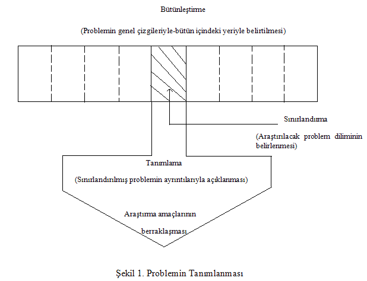
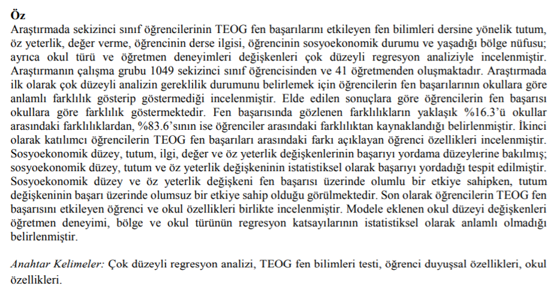

```{r child = "../setup.Rmd"}
```

```{r set-theme, include=FALSE}
library(emoji)
library(xaringanthemer)
style_duo_accent(
  primary_color      = "#0F4C81", # pantone classic blue
  secondary_color    = "#B6CADA", # pantone baby blue
  header_font_google = google_font("Raleway"),
  text_font_google   = google_font("Raleway", "300", "300i"),
  code_font_google   = google_font("Source Code Pro"),
  text_font_size     = "30px"
)
```

```{r, include=FALSE}
advdate <- function(obj, adv) {
 tmon <- obj + 7*(adv-1)
 # tfri <- obj + 4 + 7*(adv-1)
 tmon <- format(tmon, format="%d/%m")
 # tfri <- format(tfri, format="%d/%m")
 zadv <- sprintf("%02d", adv)
 tmp <- paste("Hafta ",zadv,sep='',", ", tmon)
 return(tmp)
}

library(lubridate)
options(scipen=999)
library(tidyverse)
library(stevemisc)
mon <- ymd(20220207)
```

# Probleminin Tanımlanması I .huge[`r emo::ji("stats")`]

.hand[İçerik...]

-   Araştırma Problemin Tanımlanması
-   İyi bir araştırma probeliminin sahip olması gereken özellikler
-   Problem ve alt problemler
-   Literatur Taraması

---


.hand[

 Problemin tanımlanması, 

 çoğu kez çözülmesinden daha önemlidir.

                                  Albert Einstein
]

---

- Defne öğretmen, farklı öğretim yöntemlerinin öğrencilerinin başarılarına nasıl bir etkisi olduğunu belirlemek istiyor,

- Ahmet öğretmen, okulundaki öğrencilerin en çok hangi spor dalına ilgi duyduklarını öğrenmek istiyor,

- Ufuk öğretmen, öğrencilerinin görsel sanatlar dersine karşı olan tutumlarını incelemek istiyor....


---
## Ig (Ignoble-Değersiz) Nobel Ödülleri

- Ig Nobel ödülleri, ilk kez 1991 yılında olmak üzere her yıl aralık ayında «Annals of Improbable Research» tarafından Harvard Üniversitesi’nde düzenlenen törenle değersiz, saçma, yeniden üretilmeyecek ve üretilmemesi gereken bilimsel çalışmalara verilen ödüllerdir.

- Bu ödülü kazanan araştırmalar, gerçek veriler içeren ve prestijli bilimsel dergilerde yayımlanmış olan çalışmalardır. Ig Nobel ödülündeki amaç, hayal gücünü onurlandırmak ve insanların dikkatini çekmektir.`r emo::ji('link')` [bağlantı](https://tr.wikipedia.org/wiki/Ig_Nobel_%C3%96d%C3%BClleri#:~:text=Ig%20Nobel%20%C3%B6d%C3%BClleri%2C%20Harvard%20%C3%9Cniversitesi,ignoble%20kelimesinden%20t%C3%BCretilmi%C5%9F%20bir%20kelimedir.)<br>
(akt: Şahin ve İlhan, 2021). 


---
## Araştırma Problemi


- Problem, **güçlük yaratan**, varolduğu sürece **engel oluşturan** ve bu nedenle değiştirilmesi gereken bir durumdur. Araştırmacı bu özellikleri taşıyan bir durumu seçer ve çözmeye çalışır. 


---
## Araştırma Problemi


- Araştırma problemi tam olarak araştırmacının araştırmak istediği sorundur. 

  - Günlük yaşamda karşılaşılan/gözlemlenen sorunlar,
  - Uygulamalarda karşılaşılan sorunlar,
  - Geçmiş araştırmaların sonuçları,
  - Kuramlar


---
## Araştırma Problemi
Araştırma probleminde bulunması gereken önemli özellikler:

  - Çözülebilirlik (Veri elde edilebilir mi?)
  - Önemlilik (Araştırmaya değer mi?)
  - Uygulanabilirlik (Gerekli koşullar sağlanabilir mi?)
  - Yenilik
  - Etik kurallara uygun olarak uygulanabilirlik (gizlilik, gönüllü katılım, sağlık ya da esenliğin tehlikeye atılmamaması)

---
## Araştırma Problemi

- Bir bilimsel araştırma bir problemle başlar.
- İlk olarak araştırma için bir fikir bulmanız gerekir.
- Bu fikir kaynağı günlük yaşamdan, uygulamalardan, geçmiş araştırmalardan ve ya kuramlardan gelebilir. 
- Fikir kaynakları size genel bir çerçeve verecektir.
- Fikriniz sonucunda araştırma konusunu da belirleyebilirsiniz.
- Eğer enerji içeceklerin performansınız üzerinde etkisini olduğunu düşünüyorsanız araştırma fikrinizin kaynağı günlük yaşamdır.

---
## Araştırma Problemi

- Aşağıdaki araştırma soruları araştırılabilir midir?


-  Ortaöğretimde bilgisayar destekli eğitime yer verilmeli midir?
-  Sevginin insan hayatındaki anlamı nedir?


---
## Araştırma Problemi


- Aşağıdaki araştırma soruları uygun biçimde sınırlandırılmış mıdır? 

- Okuma-yazma öğretiminin en iyi yolu nedir?

- A yöntemi kullanıldığında ne kadar sürede okuma-yazma öğretilir? 

- Okuma-yazma öğretiminde A ve B yöntemlerinden hangisi daha etkilidir?

---
## Araştırma Problemi

- Problem seçiminde dikkat edilmesi gereken özel ölçütler: 

- Alanda Yeterlik (Araştırmacının ilgili alan bilgisi yeterli mi?)

- Yöntem ve Teknikte Yeterlik (Araştırmacı gerekli istatistik, yöntem, ölçme bilgisine sahip mi?)

- Veri Toplama İzni 

- Zaman ve Olanak Yeterliği (Zaman, eleman, mali güç)

- İlgi Yeterliği (bütün güçlükleri karşılamaya, olumsuz sonuçlara hazır mı?)


---
## Araştırma Problemi Bulmada İzlenecek Yollar


- Problem ile doğrudan ilgili olan kaynaklara ulaşmak

- Aktif okuma becerisini geliştirmek
 
- Materyalleri tekrar okumak

- İddialardaki tutarsızlıkları araştırmak

- Varsayımları sorgulamak


---
## Araştırma Problemi Bulmada İzlenecek Yollar


- Okunan kaynakları düzenlemek

- Alışılagelmiş düşünce kalıplarını kırmak

- Alan uzmanları ile görüşmek

- Araştırma problemini incelemek için yeni yollar aramak

- Orijinal ve eski metinlerden probleme kaynaklık eden durumları incelemek


---
## Araştırma Problemi Bulmada İzlenecek Yollar


- Fikirleri basitleştirmek

- Problemi yazılı olarak ifade etmek

- Fikirlerimizi diğer insanlarla paylaşmak

- Konu ile ilgili internet ortamındaki forumları araştırıp, oralarda tartışmak


---
## Araştırma Problemi Bulmada İzlenecek Yollar

Araştırma ;

- Yapılabilir olmalıdır.

- Problemi açıkça ifade edilmiş olmalıdır.

- Önemli olmalıdır.

- Kuramsal temele dayanmalıdır

---
## Araştırma Problemi Özellikleri

- Akla yatkın olmalıdır.

- Anlamlı olmalıdır.

- Açık ve anlaşılır olmalıdır.

- İfadeler emir ve olasılık kipi şeklinde kurulmamalıdır.

- Sınanabilir, test edilebilir, ölçülebilir olmalıdır.

- Orijinal ve özgün olmalıdır.

- Etik olmalıdır.

- Araştırma probleminizin araştırmaya değer, özgün ve anlamlı olup olmadığına literatür taraması ile karar vermelisiniz.


---


.pull-left-narrow[
## Araştırma Süreci

```{r echo=FALSE, fig.align='center',out.width="100%"}

```
]
.pull-right-wide[
- Altıncı sınıf öğrencilerinin matematik başarısıyla ailenin sosyo-ekonomik düzeyi (SED)arasındaki ilişkiyi incelemek isteyen bir araştırmacı
- **Bütünleştirme** aşamasında: genel akademik başarı, etkileyen faktörlerden bahsedebilir
- **Sınırlandırma** aşamasında: 6. sınıf öğrencileri, matematik başarısı ve SED değişkenlerine sınırlandırır
- **Tanımlama** aşamasında, bu değişkenler açıklanır
  - Altıncı Sınıf öğrencileri ne demek
  - Matematik başarısı ile ne kastediyor
  - Sosyo-ekompnmik düzey nasıl ölçülecek

]
---

## HANGİ SORULAR ARAŞTIRILABİLİR? NEDEN?

- Varlık var mıdır?

- Okul öncesi öğrencileri, görsel sanat dersinin uzaktan eğitim yöntemiyle  uygulanmasında ne kadar başarılılar?

- Lise mezuniyet puanı üniversite öğrencilerinin akademik başarısını etkiliyor mu?

- Yabancı dil öğretmenin en iyi yolu nedir?

- İkinci Dünya Savaşı olmasaydı bugün dünya düzeni nasıl olurdu?


<!-- Soru 4 bir şeyi yapmanın "en iyi" yolunu sorar. Bunu bir an düşünün. Herhangi bir şeyi yapmanın en iyi yolunu belirlememizin bir yolu var mı? Bunu belirleyebilmek için, mümkün olan her alternatifi incelemeliyiz ve bir anlık yansıma bizi bunun asla başarılamayacağının farkına götürür. Tüm olası alternatiflerin incelendiğinden nasıl emin olabilirdik? Soru 5, imkansız koşulların yaratılmasını gerektirir. Elbette, insanların okulların nasıl olacağını düşündüklerini araştırabiliriz. Şekil 2.1, araştırılabilir ve araştırılamaz arasındaki farkı göstermektedir -->
<!-- sorular. -->


---

.pull-left[
## Araştırılamayan Sorular	

- Çocuğumu dil kursuna göndermeli miyim?	

- Yazmayı öğrenmenin en iyi yolu nedir?	

- Bazı insanlar doğuştan kötü müdür?

]
.pull-right[
## Araştırılabilir Sorular

- Dil kursuna giden çocukların konuşma becerileri gitmeyen çocuklara göre daha iyi gelişiyor mu?

- Çocuklara harfleri hangi yaşta (5, 6 ya da 7 yaş) tanıtmak daha faydalıdır?

- Yaşlı insanlar mı genç insanlar mı daha çok suç işliyor?

]

---
## LİTERATÜR TARAMASI

- Literatür taraması, belirli bir konuyla ilgili yapılmış çalışmaların, araştırılma, erişilme ve değerlendirilme süreci ve kapsamlı bir özetidir.

- Araştırma konusu ve cevap bulunması hedeflenen problemlerle ilgili mevcut bilgi durumunu açıklayan kaynakların yazılır bir özetidir (Creswell, 2012; akt: Taşdelen Teker, 2021).

- **Sistemli** ve **amaç doğrultusunda** yapılmalıdır.

---

.center[
## LİTERATÜR TARAMASI YAPARKEN İZLENCEK ADIMLAR

```{r echo=FALSE, fig.align='center', fig.retina=3, message=FALSE, warning=FALSE}

l <- DiagrammeR::mermaid("
        graph TB
        A[Araştırma sorusu gözden geçirilir.]
        A --> B[Literatür taramasında kullanılacak anahtar kelimeler belirlenir.]
        B --> C[Konu hakkındaki literatür bulunur.]
        C --> D[Karşımıza çıkan literatür eleştirel gözle değerlendirilir ve uygun olanlar seçilerek özetleri çıkarılır.]
        D --> E[Araştırma raporuna eklemek için literatür özetlerini içeren bir literatür taraması yazılır.]
        ")


widgetframe::frameWidget(l)
```

]


---
## LİTERATÜR TARAMASINDA DÖRT TEMEL YÖNTEM

- Elektronik veri tabanı inceleme ve kütüphane taraması yapma

- Kaynakça inceleme

- Araştırma konusu ile ilgili bilimsel dergileri inceleme

- Yazar/araştırmacı arama/bağlantı kurma
---
## VERİ TABANI İNCELEME

- `r emo::ji('link')` [Trdizin](https://trdizin.gov.tr/)

- `r emo::ji('link')` [Ulusal Tez Merkezi](https://tez.yok.gov.tr/UlusalTezMerkezi/)

- `r emo::ji('link')` [ERIC](https://eric.ed.gov/ )

- `r emo::ji('link')` [PROQUEST](https://www.proquest.com/ )


---
## Birincil ve İkincil Kaynaklar


- **Birincil Kaynaklar:** Özgün kitapların veye makalelerin yayımlandığı dergiler, kitaplar, **özgün** olan çalışmalar örnek verilebilir. 

- **İkincil Kaynaklar:**  **Başka araştırmacıların, araştırma sonuçlarını** veren yayınlar, ansiklopediler, yüksek lisans/doktora tezlerinin kitap olarak basılmış hali örnek verilebilir. 


---
## Literatür Taraması İçin İpuçları

- Literatür taramasına başlamadan önce **anahtar kelimelerinizi** belirleyiniz.

- Literatür çalışmanızı **yeni tarihli** araştırmalardan başlayınız.

- Önce **genel** bir tarama yapınız, sonrasında **özele** odaklanarak konuyu daraltınız. 

- Çalışmaların **özet** kısmını okuyunuz.

- **Birincil kaynaklara** ulaşmaya çalışınız (Büyüköztürk vd., 2020; Ocak ve Olur, 2019).


---
## Literatür Taraması İçin İpuçları


```{r echo=FALSE, fig.align='center',out.width="50%"}

```

Ulutan, E. & Çobanoğlu Aktan, D. (2019). Fen bilgisi başarısını etkileyen değişkenlerin çok düzeyli regresyon modeli ile incelenmesi. *Journal of Measurement and Evaluation in Education and Psychology, 10*(4), 365-377. doi: 10.21031/epod.533713 

---
## Anahtar Kelimelerin Belirlenmesi

- Araştırmamızın **daraltılmasını** sağlar.  

- Çok genel ya da çok özel **olmamalı**dır.

- Anahtar kelimelerin **eş anlamlılarıyla** da arama yapmayı unutmayın.


Dergilerde yayınlanan makaleleri tararken, ulusal ya da uluslararası dergilerin **hakemli dergiler** olmasına dikkat edelim. 

---
## Yararlanılan Kaynaklar

- Büyüköztürk, Ş., Çakmak E. K., Akgün, Ö. E., Karadeniz, Ş., Demirel, F. (2020). *Eğitimde Bilimsel Araştırma Yöntemleri* (28. Baskı), Ankara: Pegema Yayıncılık.

- Ocak, İ. ve Olur, B. (2019). Bilimsel Araştırma Süreci: Giriş. G. Ocak (Edt.), *Eğitimde Bilimsel Araştırma Yöntemleri* içinde (2-61). Ankara: Pegema Yayıncılık. 
