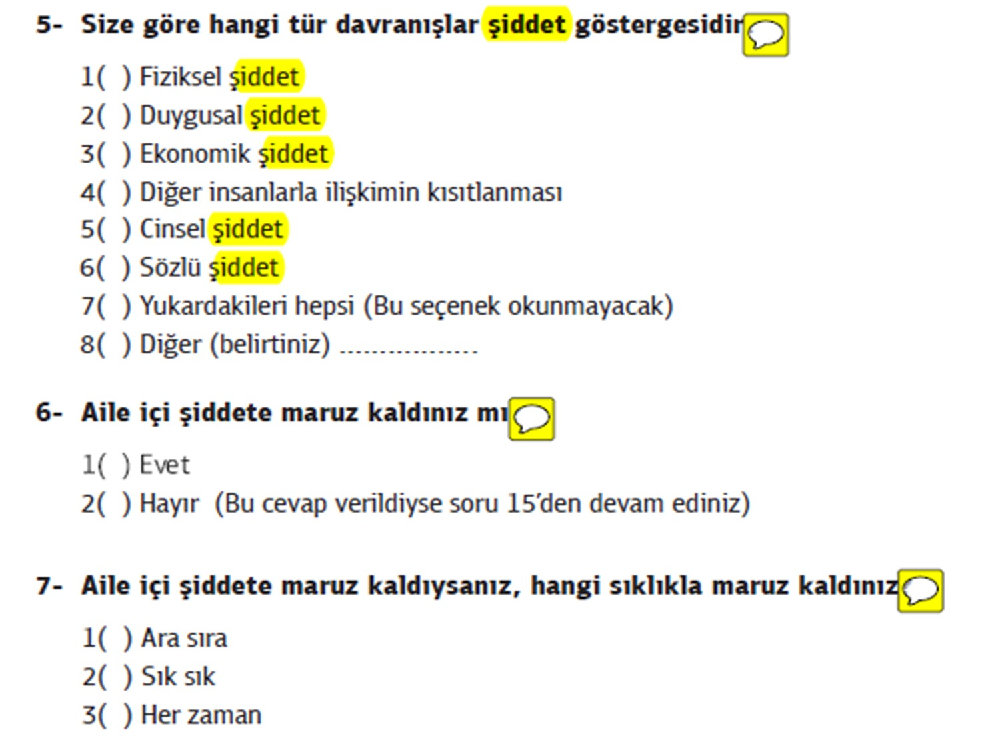

```{r child = "../setup.Rmd"}
```

```{r set-theme, include=FALSE}
library(emoji)
library(xaringanthemer)
library(dplyr)


library(DiagrammeR)
library(DiagrammeRsvg) 
library(rsvg) 

maddetur <- grViz("digraph{
   graph[rankdir = TB]
   node[shape = rectangle, style = empty] 
       A[label = 'Anket Maddeleri']
       B[label = 'Açık Uçlu Maddeler']
       C[label = 'Kapalı Uçlu Maddeler']
       D[label = 'Yorumlama Soruları']
       E[label = 'Listeleme Soruları']
       F[label = 'Boşluk Doldurma Soruları']
       G[label = 'Sınıflama Soruları']
       H[label = 'Sıralama Soruları']
       I[label = 'Dereceleme Soruları']
                     edge[color = red]
                     A -> B [color = black]
                     A -> C [color = black]
                     B -> D [color = black]
                     B -> E [color = black]
                     B -> F [color = black]
                     
                     C -> G [color = black]
                     C -> H [color = black]
                     C -> I [color = black]
                     }")

```


## Nicel Verilerin Toplanması ve Analizi .huge[`r emo::ji("stats")`]

.hand[İçerik...]

-   Veri Nedir?
-   Nicel Veri Toplama Araçları
    -   Anketler
    -   Ölçek
    -   Envanter
    -   Test
-   Çevirim için veri toplama araçları
-   **ODEV-III (++) Çevirim içi Anket Hazırlama**

---
## Veri Nedir?

- Veri nedir? 

- Verileri nasıl elde edebiliriz?

- Veri toplama araçlarını nasıl uygulayabiliriz?


---
## Eğitimde kullanılan başlıca veri toplama araçları:

- Anketler
- Ölçekler
- Testler
- Gözlem formları
- Görüşme formları

---

```{r echo=FALSE, fig.align='center',out.width="90%"}
knitr::include_graphics("img/emoji.png")
```


---
## Veri Toplama Araçları

- Araştırmanın en önemli aşamalarından biri, birey veya nesnelerden bilgiyi **nasıl** elde edeceğimiz sorusunun yanıtını bulabileceğimiz veri toplama yöntem, teknik veya aracının seçilmesidir.

- Bir bilimsel araştırmada herhangi bir yöntem, teknik ya da araçla elde edilen her türlü değer veri olarak adlandırılır.

---
## Veri Toplama Araçları

- Araştırma kapsamında ihtiyaç duyulan **verinin nasıl toplanacağına** ilişkin kararı araştırmacıların **planlama aşamasında** vermesi gerekmektedir.

- Derinlemesine, uzun süreli ya da etkileşimli bilgiye mi yoksa geniş ölçekli, yüzeysel ve anlık bilgiye mi ihtiyacın olduğu verilerin toplanmasında düşünülmesi gereken önemli bir unsurdur.

---
## Anket

- Anketler günlük hayatta en sık karşılaştığımız ölçme araçlarından biridir.

- Alışveriş yaptığımız bir internet sitesinde kendilerine nasıl ulaştığımızın;  
internet ara yüzünü yenileyen bir bankanın yeni ara yüze ilişkin memnuniyet düzeyimizin;  
akşam oynanacak bir derbi maçta kimin kazanacağına ilişkin düşüncemizin veya   
belediyenin sosyal kültürel faaliyetlerine katılım sıklığımızın belirlenmesi gibi amaçlarla anketlerle karşılaşmaktayız.

---
## Anket

- Bir konu üzerinde belirlenmiş **sorular** yoluyla bireylerin **düşüncelerini** kısa sürede belirli bir düzen içerisinde toplamayı sağlayan bir ölçme aracıdır (Ocak, 2019). 

---
## Anket

- Beyana dayalı **nicel veri toplama aracıdır.**
Odak kapalı uçlu sorularla nicel veri elde etmektir.

- Anketlerde ek olarak açık uçlu sorularla nitel veriler de toplanabilir.

- Ankette yer alan sorular genel olarak birbirinden bağımsız olarak ele alınır ve farklı şeyleri ölçmeye odaklıdır.

- Geniş anketlerde istisna olarak anketin bir bölümü psikolojik bir yapıyı ölçmeye yönelik olabilir. Bu kısım ölçek gibi ele alınır.

---
## Anket

Soru Türleri
- Olgusal Sorular `r emo::ji('right')`  demografik özelliklerin betimlenmesi (yaş, cinsiyet, meslek vb.)

- Bilgi Soruları `r emo::ji('right')`  bir konuda (sosyal, ekonomik, politik vb.) ne bildikleri ve bilgiye ulaşma kaynaklarının belirlenmesi 

- Davranış Soruları `r emo::ji('right')`  bir konuya ilişkin davranışlarının belirlenmesi (tüketim davranışları, sınıfiçi öğrenci davranışları vb.)

- İnanç ve Kanı soruları `r emo::ji('right')`  bir konuya ilişkin duygu ve düşünce belirlenmesi (iş doyum algısı, kurum içi atama uygulaması hakkında görüş, vb.) 

---
## Anket Geliştirme Süreci


```{r echo=FALSE, fig.align='center',out.width="90%"}
knitr::include_graphics("img/Anketgelistirme.png")
```


---
## Anket 

- Geçerli bir anket geliştirmek için araştırma **probleminin iyi tanımlanmış** ve araştırmanın amaçlarının iyi biçimlenmiş, olabildiğince kesin ve açıkça anlaşılır biçimde belirlenmiş olması gerekir.

- Araştırmada incelenecek **değişkenlerin çok iyi tanımlanması,** hem araştırmanın hem de anketin sınırlarının belirlenmesine yardımcı olur. 

---
## Anket 

**Amaç:** Özel Eğitime Gereksinim Duyan (ÖEGD) ve ilköğretimde kaynaştırma programına katılan 6-14 yaş çocukların akranları tarafından istismarı ve ihmalini incelemek

1. ÖEGD çocuk ve akranlarının görüşlerine göre ÖEGD çocuklar, akranları tarafından fiziksel istismar ve ihmale uğramakta mıdırlar?  

2. ÖEGD çocuk ve akranlarının görüşlerine göre ÖEGD çocuklar, akranları tarafından duygusal istismar ve ihmale uğramakta mıdırlar?  

3. ÖEGD çocuk ve akranlarının görüşlerine göre ÖEGD çocuklar, akranları tarafından cinsel istismar ve ihmale uğramakta mıdırlar?  

---

## Anket 

**Amaç:** Öğretmenlerin yeni ders programı hakkındaki görüşlerini belirlemek

1. Öğretmenlerin programın bağlamına ilişkin görüşleri nedir?

2. Öğretmenlerin programın kazanımlarına ilişkin görüşleri nedir?

3. Öğretmenlerin programın süreçlerine ilişkin görüşleri nedir?
- Öğretme ve öğrenme 
- Ölçme ve değerlendirme

---
## Anket 

- Problemin tanımlanması aşamasında, hangi bilgileri toplayacağına, nereden toplayacağına, kimlerden toplayacağına, topladığı bilgileri nasıl kullanacağına karar verir.

- Madde yazma aşamasında alt problemlerde yer alan değişkenlerden yola çıkarak, verilerin toplanmasına ilişkin maddeler yazılır. Maddeler konuyla ilgili kuramsal çerçeveye göre hazırlanmalıdır. 

---
## Anket 

- Daha önce yapılmış benzer araştırmalar varsa, bunlarda yer alan anket maddelerinin incelenmesi de araştırmacıya bir fikir verebilir.

- Araştırmacı soruları ve seçenekleri oluşturmakta zorlanıyorsa, küçük bir gruba araştırmanın alt problemleri ile ilgili açık uçlu sorular sorar. Bu soruların içerik analizi, anket maddelerinin oluşturulmasına yardımcı olur.


---

## Madde Türleri

```{r echo=FALSE, message=FALSE, warning=FALSE}

widgetframe::frameWidget(maddetur)

```

---
## AÇIK UÇLU SORULAR /YORUMLAMA SORULARI


```{r echo=FALSE, fig.align='center',out.width="90%"}
knitr::include_graphics("img/acikuclu.png")
```

---
## AÇIK UÇLU SORULAR /LİSTELEME SORULARI

```{r echo=FALSE, fig.align='center',out.width="90%"}
knitr::include_graphics("img/listeleme.png")
```

---
## AÇIK UÇLU SORULAR /BOŞLUK DOLDURMA  SORULARI

**Örnek:** Kaç yıldır bu kurumda öğretmenlik yapmaktasınız. Lütfen yıl olarak yazınız . **....**


---
## KAPALI UÇLU SORULAR /SINIFLAMA SORULARI

```{r echo=FALSE, fig.align='center',out.width="90%"}
knitr::include_graphics("img/kapalıuclu.png")
```

---
## KAPALI UÇLU SORULAR /SIRALAMA SORULARI


```{r echo=FALSE, fig.align='center',out.width="90%"}
knitr::include_graphics("img/siralama.png")
```


---
## KAPALI UÇLU SORULAR /SIRALAMA SORULARI

```{r echo=FALSE, fig.align='center',out.width="90%"}
knitr::include_graphics("img/dereceleme.png")
```

---
## Uzman Değerlendirme Formu

```{r echo=FALSE, fig.align='center',out.width="90%"}
knitr::include_graphics("img/uzman.jpg")
```

---
## Ölçekler

- Psikoloji alanındaki bilimsel çalışmaların büyük çoğunluğu, özgün veya uyarlama sonucu kültürümüze kazandırılan psikolojik ölçme araçlarıyla, ölçeklerle, elde edilen verilere dayanmaktadır (Erkuş, 2007).

- Ölçekler, doğrudan gözlemlenemeyen teorik olarak var olan değişkenlerin düzeylerini ortaya çıkarmayı amaçlayan maddelerden oluşan ölçme araçlarıdır.

---
## Ölçekler

- Likert tipi ölçekler R. Likert tarafından 1932 yılında tutumları ölçmek amacıyla geliştirilmiş bir ölçekleme tekniğidir. Diğer adı dereceleme toplamlarıyla ölçeklemedir. 

- Likert tipi ölçekler, bireyin kendisi hakkında bilgi vermesi esasına dayalıdır. 

- Bir soruya verilebilecek tepkiler derecelendirilir ve işaretlenen derecelerin toplanmasıyla bir cevaplayıcının puanı elde edilir.

---
## Ölçekler

- Bireylere belirli bir konuya ilişkin tutumları ile ilişkili bir dizi olumlu ve olumsuz cümle verilir. Cevaplayıcılar her ifadeye  
 - Tamamen katılıyorum
 - Katılıyorum
 - Kararsızım
 - Katılmıyorum
 - Kesinlikle katılmıyorum
- Seçeneklerinden biri ile tepkide bulunurlar.


---
## Ölçekler

- Olumlu tutum cümleleri için “tamamen katılıyorum” tepkisi, cevaplayıcının  ölçülen konuya ilişkin aşırı olumlu tutum içinde olduğunu; “kesinlikle katılmıyorum” tepkisi de aşırı olumsuz tutum içinde olduğunu gösterir. 

---
## ölçek geliştirme aşamaları:

- Ölçülecek tutumun (özelliğin) tanımlanması
- Deneme ölçeğinin hazırlanması ve deneme uygulaması
- Deneme ölçeğinden elde edilen verilerin analizi ve - tutum ölçeğinin oluşturulması


---
**Likert tipi ölçekler için tutum ifadeleri yazmada dikkat edilecek noktalar:**

- Maddeler bir görüşün/eğilimin ifadesi olmalıdır. 
- Olgusal ifadeler olmamalıdır.
- Örn. ABD’de zenci bir başkan seçilmesi tüm dünya kamuoyunu etkilemiştir.

---
**Likert tipi ölçekler için tutum ifadeleri yazmada dikkat edilecek noktalar:**

- Cevaplayıcıların maddeye katılma ya da katılmama durumu, maddedeki ifadenin doğruluk ya da yanlışlığının yargılanabilmesine bağlı olmalıdır. Olgusal gerçekliği olan ifadeler, bireyleri tutumları bakımından ayırmaz.

- Devlet başkanları, ülkede ırk, din, vb. bakımından çoğunlukta olan gruplar arasından seçilmelidir.

- Tutum ifadeleri ayrıca, bireylerin geçmişteki değil şu andaki tutumlarını ifade etmelidir

---
**Likert tipi ölçekler için tutum ifadeleri yazmada dikkat edilecek noktalar:**

- Maddeler, farklı anlamlara yol açmadan öz ve sade bir biçimde ifade edilmelidir. 

- Bir maddede birden fazla yargı bulunmamalıdır.

- Örn. Trafik kazalarını önlemek için trafik cezaları daha da ağırlaştırılmalı ve ehliyet alma yaşı 21’e yükseltilmelidir.

- Bir ifade içinde çift olumsuz bulunmamalıdır. 

- Maddelerde olabildiğinde –me, -ma gibi olumsuzluk eklerinden kaçınılmalıdır.

---
**Likert tipi ölçekler için tutum ifadeleri yazmada dikkat edilecek noktalar:**

- Tutumun olumlu ya da olumsuz içeriğini ılımlı bir şekilde ifade eden maddeler tercih edilmelidir. 

- Çünkü, cevaplama seçenekleri tutumun aşırı uçlarını ifade etmektedir.

- Ilımlı maddeler, cevaplayıcıların tercihlerini daha doğru ifade etmelerini ve maddelerin daha ayırıcı  olmalarını sağlar. 

- Ayrıca, nötr tepkileri ifade eden maddelerin de bulunmasına gerek yoktur, çünkü “kararsızım” seçeneği zaten bu durumu ifade etmektedir.

---
**Likert tipi ölçekler için tutum ifadeleri yazmada dikkat edilecek noktalar:**

- Bir kez trafik cezası alan sürücünün ehliyeti süresiz olarak iptal edilmelidir. (aşırı tutum ifadesi)

- Trafik cezalarının caydırıcı özelliği artırılmalıdır. (ılımlı tutum ifadesi)

- Trafik cezalarında yapılacak herhangi bir düzenleme ile ilgilenmiyorum. (nötr tutum ifadesi)

---
**Likert tipi ölçekler için tutum ifadeleri yazmada dikkat edilecek noktalar:**

- Boş bırakılma ya da kalıp yargılara dayalı tepkilerden kaçınmak için maddelerin yarısı olumlu yarısı olumsuz tutumu ifade etmelidir.

- Teknolojik araçların günlük hayatımızı kolaylaştırdığını düşünüyorum.

- Bence teknoloji insanları mutsuz etmektedir. 

---
**Likert tipi ölçekler için tutum ifadeleri yazmada dikkat edilecek noktalar:**

- Olumsuz anlam yüklü madde yazarken, olumlu bir ifade olumsuza dönüştürülmemelidir. Bu durum cevaplayıcıları yanıltır, motivasyonlarını düşürür.
- Örn.
- Matematikten çok hoşlanırım.
- Matematikten hiç hoşlanmam.    

    ifadesi yerine

- Matematik çalışmak bana çok sıkıcı gelir

---
**Likert tipi ölçekler için tutum ifadeleri yazmada dikkat edilecek noktalar:**

- Likert, ölçek maddelerinin beklenen yönde işlemesine engel olan bazı nedenleri şöyle sıralamıştır:

- Madde diğer maddelerden farklı bir içerikte olabilir.

- Madde bütün cevaplayıcılarda aynı yönde tepki uyandırabilir.

- Madde cevaplayıcılar tarafından değişik şekillerde anlaşılmış olabilir.

- Madde olgu ifade ediyorsa tutumları farklı bireylerin çoğunluğu tarafından kabul ya da reddedilebilir. 


---
**Deneme ölçeğinin düzenlenmesi ve deneme uygulaması**

- Deneme uygulamasında, genellikle ölçekte bulunması istenen madde sayısının iki-üç katı madde olması istenir. 

- Deneme uygulamasından sonra amaca hizmet etmeyen maddeler elendiğinde istenilen sayıda madde kalmış olur. 
- Çok sayıdaki maddeden istenen ayırt edicilik gücünde maddeleri seçme olanağı daha fazladır. 


---
**Deneme Uygulaması**

- Maddeler yazıldıktan sonra ölçeğin başına bir yönerge yazılır. 

- Likert tipi ölçek maddeleri genelde 5 kategorilidir. 3 veya 7 kategorili olanları da vardır. Bir ölçekte farklı kategoride ya da farklı cevaplanma biçiminde maddeler yer alıyorsa bunlar gruplandırılmalıdır ve her grubun başına bir yönerge konulmalıdır.

- Olumlu ve olumsuz anlam yüküne sahip maddeler, ölçekte karışık bir sıra içinde yerleştirilmelidir. Olumlu ve olumsuz anlam yüklü madde sayıları mümkünse birbirine eşit olmalıdır.


---
**Deneme Uygulaması**

- Deneme uygulamasından önce maddeler aşağıdaki noktalar açısından incelenmelidir.
 - Maddeler ölçülmek istenen tutumu ölçüyor ve tamamen kapsıyor mu?
 - Her maddede, madde yazma kurallarına uyulmuş mu?
 - Olumlu ve olumsuz ifadelerin sayısı eşit mi?
 - Aynı tutum ögesini içeren hem olumlu hem olumsuz maddelerden kaçınılmış mı?

---
**Deneme Uygulaması**

- Her madde ölçülen tutumu birbirinden bağımsız olarak ölçüyor mu?
 - Yazım hataları ve anlatım bozuklukları giderilmiş mi?
 - Ölçek maddeleri kolaylıkla okunup cevaplandırılabiliyor mu?
 - Yönergeler açık ve anlaşılır mı?

---
## Uygulama Şekli

- Yüz yüze görüşme
- Posta ile gönderme
- Telefon ile uygulama
- Bilgisayar yoluyla uygulama

---
## Çevirimiçi Veri Toplama Araçları


`r emo::ji('link')` [Google Formlar](https://docs.google.com/forms/d/e/1FAIpQLSdQS3eC68X92g1fx-InINCJAUQlfCucIE9_ZDRNmFe6xOmfTA/viewform?gxids=7757
)<br>

- Survey Monkey
- My Survey Lab
- LimeSurvey
- Typeform
- Qualtrics
(Aybek, 2019)

---
## Dikkat Edilecekler

- Anketi kısa ve öz tutun,

- Sorular tek bir amaca yönelik olsun,

- Kafa karıştırıcı, yoruma açık sorulardan kaçının,

- Basit ve tek anlama gelen kelimeler kullanın,

- Kişisel ve gizlilik gerektiren hassas soruları anketin sonuna yerleştirin,

- Cevap kategorilerini mantıksal olarak düzenleyin,
- Diğer seçeneğini kullanırken dikkat edin,

---
```{r echo=FALSE, fig.align='center',out.width="70%"}

```
---
## Kaynaklar

- Aybek, E. C. (2019). Verilerin Çevrimiçi Toplanması, Saklanması ve Etik. K. Yılmaz ve R. S. Arık (Edt.) **Bilim ve Araştırma Etiği** içinde (2-11). Ankara: Pegema Yayıncılık. 

- Büyüköztürk, Ş., Çakmak E. K., Akgün, Ö. E., Karadeniz, Ş., Demirel, F. (2020). Eğitimde Bilimsel Araştırma Yöntemleri (28. Baskı), Ankara: Pegema Yayıncılık. 

- Frankel, J. R.; Wallen, N. E. &  Hyun, H. H. (2012). How to Design and Evaluate Research in Education (8th Edition). New York: McGraw Hill International.

- Ocak, G. (2019). Bilimsel Araştırmalarda Kullanılan Veri Toplama Yolları. G. Ocak (Edt.), **Eğitimde Bilimsel Araştırma Yöntemleri** içinde (2-61). Ankara: Pegema Yayıncılık. 


