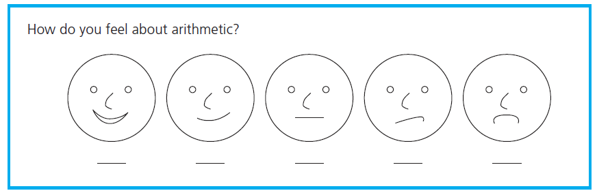
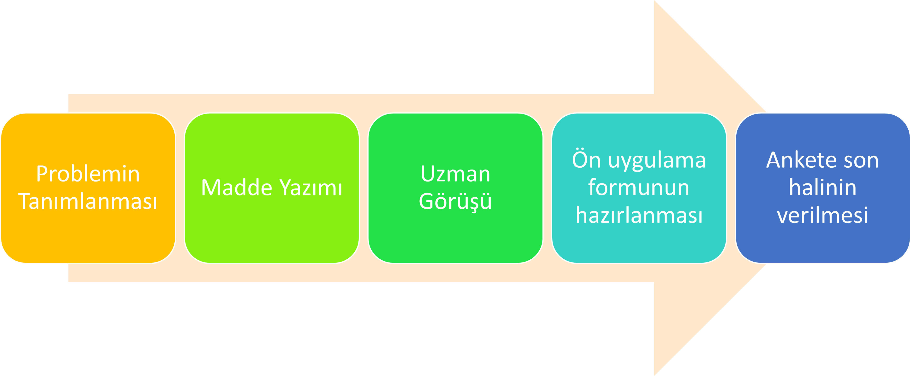
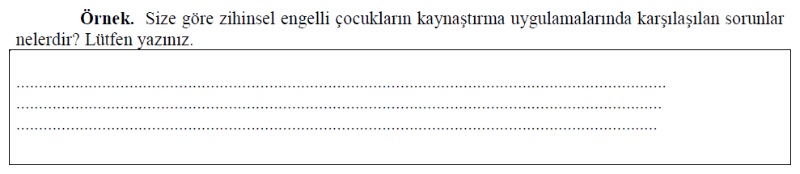
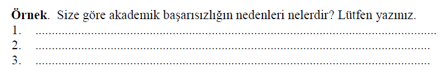
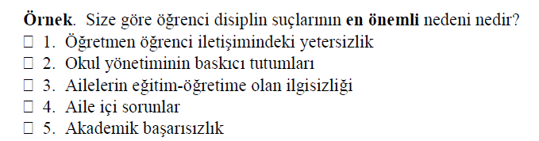
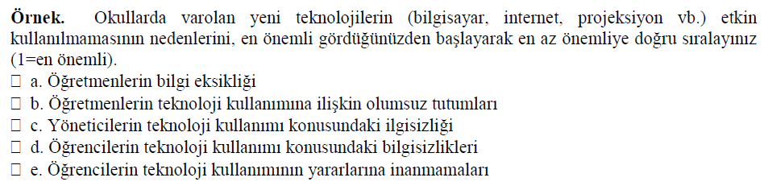
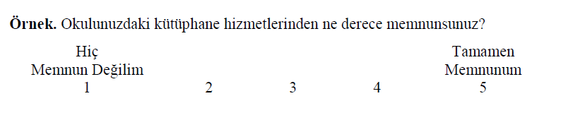
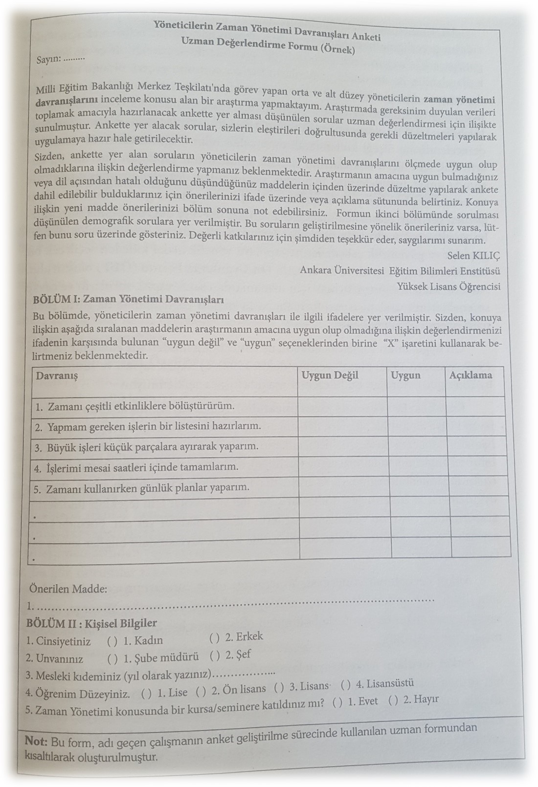

```{r child = "../setup.Rmd"}
```

```{r set-theme, include=FALSE}
library(emoji)
library(xaringanthemer)
library(dplyr)

style_duo_accent(
  primary_color      = "#0F4C81", # pantone classic blue
  secondary_color    = "#B6CADA", # pantone baby blue
  header_font_google = google_font("Raleway"),
  text_font_google   = google_font("Raleway", "300", "300i"),
  code_font_google   = google_font("Source Code Pro"),
  text_font_size     = "30px"
)
```

---
## Nicel Verilerin Toplanması ve Analizi .huge[`r emo::ji("stats")`]

.hand[İçerik...]

-   Veri Nedir?
-   Nicel Veri Toplama Araçları
    -   Anketler
    -   Ölçek
    -   Envanter
    -   Test
-   Çevirim için veri toplama araçları
-   **ODEV-III (++) Çevirim içi Anket Hazırlama**

---
## Veri Nedir?

Veri nedir? 
Verileri nasıl elde edebiliriz?
Veri toplama araçlarını nasıl uygulayabiliriz?
Ölçme ve Ölçekler
Veri toplama araçlarında bulunması gereken nitelikler:
Güvenirlik
Geçerlik

---
Eğitimde kullanılan başlıca veri toplama araçları:

Anketler
Ölçekler
Testler
Gözlem formları
Görüşme formları

---

```{r echo=FALSE, fig.align='center',out.width="90%"}

```


---
## Veri Toplama Araçları

- Araştırmanın en önemli aşamalarından biri, birey veya nesnelerden bilgiyi “nasıl” elde edeceğimiz sorusunun yanıtını bulabileceğimiz veri toplama yöntem, teknik veya aracının seçilmesidir.

- Bir bilimsel araştırmada herhangi bir yöntem, teknik ya da araçla elde edilen her türlü değer veri olarak adlandırılır.

---
## Veri Toplama Araçları

- Araştırma kapsamında ihtiyaç duyulan verinin nasıl toplanacağına ilişkin kararı araştırmacıların planlama aşamasında vermesi gerekmektedir.

- Derinlemesine, uzun süreli ya da etkileşimli bilgiye mi yoksa geniş ölçekli, yüzeysel ve anlık bilgiye mi ihtiyacın olduğu verilerin toplanmasında düşünülmesi gereken önemli bir unsurdur.

---
## Anket

- Anketler günlük hayatta en sık karşılaştığımız ölçme araçlarından biridir.

- Alışveriş yaptığımız bir internet sitesinde kendilerine nasıl ulaştığımızın; internet ara yüzünü yenileyen bir bankanın yeni ara yüze ilişkin memnuniyet düzeyimizin; akşam oynanacak bir derbi maçta kimin kazanacağına ilişkin düşüncemizin veya belediyenin sosyal kültürel faaliyetlerine katılım sıklığımızın belirlenmesi gibi amaçlarla anketlerle karşılaşmaktayız.

---
## Anket

- Bir konu üzerinde belirlenmiş **sorular** yoluyla bireylerin **düşüncelerini** kısa sürede belirli bir düzen içerisinde toplamayı sağlayan bir ölçme aracıdır (Ocak, 2019). 


---
## Anket

Soru Türleri
- Olgusal Sorular `r emo::ji('right')`  demografik özelliklerin betimlenmesi (yaş, cinsiyet, meslek vb.)

- Bilgi Soruları `r emo::ji('right')`  bir konuda (sosyal, ekonomik, politik vb.) ne bildikleri ve bilgiye ulaşma kaynaklarının belirlenmesi 
Davranış Soruları `r emo::ji('right')`  bir konuya ilişkin davranışlarının belirlenmesi (tüketim davranışları, sınıfiçi öğrenci davranışları vb.)

- İnanç ve Kanı soruları `r emo::ji('right')`  bir konuya ilişkin duygu ve düşünce belirlenmesi (iş doyum algısı, kurum içi atama uygulaması hakkında görüş, vb.) 

---
## Anket Geliştirme Süreci


```{r echo=FALSE, fig.align='center',out.width="90%"}

```


---
## Anket 

- Geçerli bir anket geliştirmek için araştırma probleminin iyi tanımlanmış ve araştırmanın amaçlarının iyi biçimlenmiş, olabildiğince kesin ve açıkça anlaşılır biçimde belirlenmiş olması gerekir.

- Araştırmada incelenecek değişkenlerin çok iyi tanımlanması, hem araştırmanın hem de anketin sınırlarının belirlenmesine yardımcı olur. 


---
## Anket 

- Problemin tanımlanması aşamasında, hangi bilgileri toplayacağına, nereden toplayacağına, kimlerden toplayacağına, topladığı bilgileri nasıl kullanacağına karar verir.

- Madde yazma aşamasında alt problemlerde yer alan değişkenlerden yola çıkarak, verilerin toplanmasına ilişkin maddeler yazılır. Maddeler konuyla ilgili kuramsal çerçeveye göre hazırlanmalıdır. 

---
## Anket 

- Daha önce yapılmış benzer araştırmalar varsa, bunlarda yer alan anket maddelerinin incelenmesi de araştırmacıya bir fikir verebilir.

- Araştırmacı soruları ve seçenekleri oluşturmakta zorlanıyorsa, küçük bir gruba araştırmanın alt problemleri ile ilgili açık uçlu sorular sorar. Bu soruların içerik analizi, anket maddelerinin oluşturulmasına yardımcı olur.


---

## Madde Türleri

```{r echo=FALSE, message=FALSE, warning=FALSE}
library(DiagrammeR)
library(DiagrammeRsvg) 
library(rsvg) 

maddetur <- grViz("digraph{
   graph[rankdir = TB]
   node[shape = rectangle, style = empty] 
       A[label = 'Anket Maddeleri']
       B[label = 'Açık Uçlu Maddeler']
       C[label = 'Kapalı Uçlu Maddeler']
       D[label = 'Yorumlama Soruları']
       E[label = 'Listeleme Soruları']
       F[label = 'Boşluk Doldurma Soruları']
       G[label = 'Sınıflama Soruları']
       H[label = 'Sıralama Soruları']
       I[label = 'Dereceleme Soruları']
                     edge[color = red]
                     A -> B [color = black]
                     A -> C [color = black]
                     B -> D [color = black]
                     B -> E [color = black]
                     B -> F [color = black]
                     
                     C -> G [color = black]
                     C -> H [color = black]
                     C -> I [color = black]
                     }")


widgetframe::frameWidget(maddetur)

```

---
## AÇIK UÇLU SORULAR /YORUMLAMA SORULARI


```{r echo=FALSE, fig.align='center',out.width="90%"}

```

---
## AÇIK UÇLU SORULAR /LİSTELEME SORULARI

```{r echo=FALSE, fig.align='center',out.width="90%"}

```

---
## AÇIK UÇLU SORULAR /BOŞLUK DOLDURMA  SORULARI

Örnek: Kaç yıldır Öğretmenlik yapmaktasınız. Lütfen yıl olarak yazınız. ....


---
## KAPALI UÇLU SORULAR /SINIFLAMA SORULARI

```{r echo=FALSE, fig.align='center',out.width="90%"}

```

---
## KAPALI UÇLU SORULAR /SIRALAMA SORULARI


```{r echo=FALSE, fig.align='center',out.width="90%"}

```


---
## KAPALI UÇLU SORULAR /SIRALAMA SORULARI

```{r echo=FALSE, fig.align='center',out.width="90%"}

```

---
## Uzman Değerlendirme Formu

```{r echo=FALSE, fig.align='center',out.width="90%"}

```

---
## ANKET UYGULAMA ŞEKLİ

- Yüz yüze görüşme
- Posta ile gönderme
- Telefon ile uygulama
- Bilgisayar yoluyla uygulama

---
## ÇEVRİMİÇİ VERİ TOPLAMA ARAÇLARI


`r emo::ji('link')` [Google Formlar](https://docs.google.com/forms/d/e/1FAIpQLSdQS3eC68X92g1fx-InINCJAUQlfCucIE9_ZDRNmFe6xOmfTA/viewform?gxids=7757
)<br>

Survey Monkey
My Survey Lab
LimeSurvey
Typeform
Qualtrics
(Aybek, 2019)

---


- Anketi kısa ve öz tutun,

- Sorular tek bir amaca yönelik olsun,

- Kafa karıştırıcı, yoruma açık sorulardan kaçının,

- Basit ve tek anlama gelen kelimeler kullanın,

- Kişisel ve gizlilik gerektiren hassas soruları anketin sonuna yerleştirin,

- Cevap kategorilerini mantıksal olarak düzenleyin,
- Diğer seçeneğini kullanırken dikkat edin,

---
## Kaynaklar

- Aybek, E. C. (2019). Verilerin Çevrimiçi Toplanması, Saklanması ve Etik. K. Yılmaz ve R. S. Arık (Edt.) **Bilim ve Araştırma Etiği** içinde (2-11). Ankara: Pegema Yayıncılık. 

- Büyüköztürk, Ş., Çakmak E. K., Akgün, Ö. E., Karadeniz, Ş., Demirel, F. (2020). Eğitimde Bilimsel Araştırma Yöntemleri (28. Baskı), Ankara: Pegema Yayıncılık. 

- Frankel, J. R.; Wallen, N. E. &  Hyun, H. H. (2012). How to Design and Evaluate Research in Education (8th Edition). New York: McGraw Hill International.

- Ocak, G. (2019). Bilimsel Araştırmalarda Kullanılan Veri Toplama Yolları. G. Ocak (Edt.), **Eğitimde Bilimsel Araştırma Yöntemleri** içinde (2-61). Ankara: Pegema Yayıncılık. 


