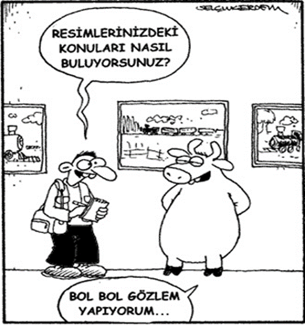
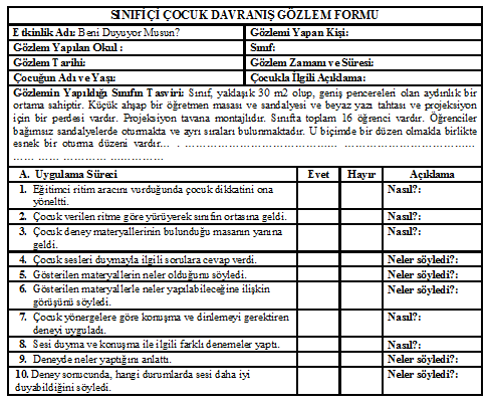
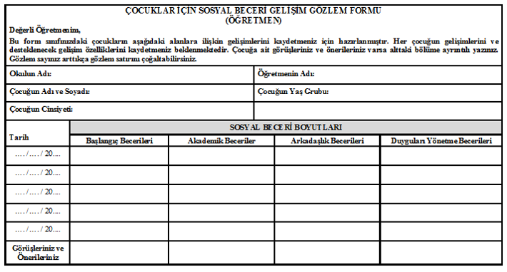
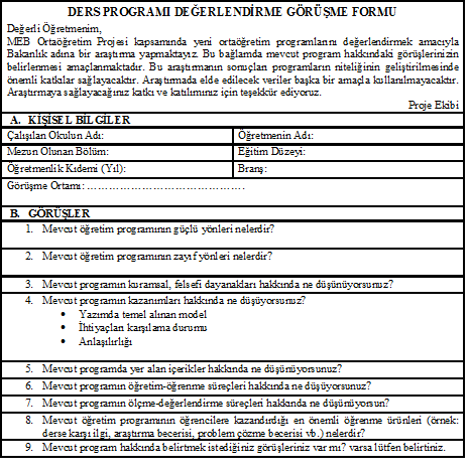

```{r child = "../setup.Rmd"}
```

```{r set-theme, include=FALSE}
library(emoji)
library(xaringanthemer)
library(dplyr)

style_duo_accent(
  primary_color      = "#0F4C81", # pantone classic blue
  secondary_color    = "#B6CADA", # pantone baby blue
  header_font_google = google_font("Raleway"),
  text_font_google   = google_font("Raleway", "300", "300i"),
  code_font_google   = google_font("Source Code Pro"),
  text_font_size     = "30px"
)
```

---
## Nitel Verilerin Toplanması ve Analizi .huge[`r emo::ji("stats")`]

.hand[İçerik...]

- Gözlem

- Görüşme

---


.pull-left[
## Gözlem

- Araştırmada ihtiyaç duyulan verilerin **insan, toplum ya da doğa** gibi belli hedeflere odaklanılarak **çıplak gözle ya da bir araç kullanılarak izlenmesi** suretiyle toplanması sürecidir (Büyüköztürk vd., 2020). 
]

.pull-right[
```{r echo=FALSE, fig.align='center',out.width="90%"}

```
]

---

.pull-left[
## Gözlem

- Gözlem formları, **gözlenen özelliğe göre, gözlemin amacına ve türüne göre** farklılık gösterebilir. 

- Kontrol listeleri ya da derecelendirme ölçekleri gözlem formu olarak kullanılabilir. Bunun yanı sıra gözlenen özelliğe ilişkin gözlemci gözlemlerini yazılı olarak kaydedebilir.

- Davranışların incelendiği çalışmalarda kullanılır.
Sınıf içi öğretmen, öğrenci davranışları
Yönetici davranışları……
]

.pull-right[
```{r echo=FALSE, fig.align='center',out.width="50%"}
knitr::include_graphics("img/gozlem_05.png")
```
]

---
## Gözlemlerin Sınıflandırılması
### Yapılandırma durumuna göre

|Yapılandırılmış Gözlem |Yapılandırılmamış Gözlem|
|---|---|
|Gözlem öncesinde **gözlenecek yapılar tanımlanır.** |Gözlem için önceden oluşturulmuş, **tanımlanmış yapılar yoktur.**  |
|Bilginin toplanması ve kaydedilmesi için oluşturulmuş bir **kodlama sistemi vardır.**|Gözlemciye  **veri toplamada ve kaydetmede esneklik, özgürlük vardır.** |

---
## Yapılandırılmış Gözlem

|Katılımcı Gözlemci| Katılımcı Olmayan Gözlemci |
|---|---|
|Katılımcı gözlediği grubun bir üyesidir. Grup içinde bir rol üstlenir . | Dışarıdan gözlem yapılır. Gözlemci, gözlem yapılan ortamda bulunur. |
|  |  |
|Küçük gruplarda, **kısa süreli , sık tekrarlanan etkinliklerde, nitel araştırmalarda ve yapılandırılmamış gözlemlerde** önerilir. |**Dilin, geleneğin, değerlerin, yazılı-yazısız kuralları  araştırmak için önerilir.** Yapılandırılmamış ve yapılandırılmış gözlemlerde kullanılabilir. | 
| **Örnek: Grup davranışlarının dinamiklerini anlamak** | **Örnek: Öğrenci davranışları** |


---
## Katılımcı Gözlem 

- Katılımcı Gözlemde Oluşabilecek Ön Yargılar


- Seçici dikkat

- Seçici kodlama

- Seçici bellek

- Kişilerarası etkenler


---

```{r echo=FALSE, fig.align='center',out.width="60%"}

```


---

```{r echo=FALSE, fig.align='center',out.width="90%"}

```
---

.pull-left-wide[

## Görüşme

- En az iki kişi arasında sözlü olarak   sürdürülen veri toplama amaçlı bir iletişim sürecidir.

- Derinlemesine bilgi sağlar. 

- Güvenilir ve geçerli sonuçlar elde etmenin zorluğu yaşanır. 

- Büyük resmin ne olduğunu anlamak esastır. “Bütünsel yorumlama”

- İyi bir görüşme, bireysel düşünceler ve inanışlar hakkında tarafsız bilgi edinme sanatı ve bilimi olarak tanımlanır.
]

.pull-right-narrow[
```{r echo=FALSE, fig.align='center',out.width="60%"}
knitr::include_graphics("img/gozlem_05.png")
```
]
---
## Görüşme

- Görüşme, daha çok tarama araştırmalarında kullanılan bir tekniktir. Araştırmacı, bilgi toplamak istediği kişilerle yüz yüze görüşür. 

- Görüşme öncesinde, **araştırmanın amacına uygun olarak soruların yer aldığı bir görüşme formu hazırlanır.** 

- Araştırmacı görüşme yaptığı kişilere bu soruları sorar, cevaplarını yazılı ya da ses kaydı olarak kaydeder.


---

```{r echo=FALSE, fig.align='center',out.width="60%"}

```

---
## Görüşmelerin Sınıflandırılması

| Yapılandırılmış Görüşme    | Yarı Yapılandırılmış Görüşme | Yapılandırılmamış Görüşme |
|---|---|---|
| Önceden hazırlanmış sıralı sorular vardır. Genellikle sunulan seçeneklerden birinin seçilmesi istenir. Görüşmeciyi kısıtlaması, temel dezavantajlarıdır. Nitel çalışmalarda önerilmez. | Sorular önceden tanımlıdır. Analizlerin kolaylığı, görüşülene kendini ifade etme imkanı gibi avantajları;  önemsiz konularda fazla zaman harcanması gibi dezavantajları bulunur. | Araştırmacıya konuyla ilgili soru sormada serbestlik sağlar. Sorular ve sıraları görüşme sürecinde gelişir. |
 
---
## Görüşmelerin sınıflandırılması…

- **Etnografik görüşme:** Yapılandırılmamış görüşmelere girer. Bu tür görüşmelerle, grubun/bireyin kültürel yapılarının ve bu yapıları oluşturan davranış ve deneyimlerin açıklanması amaçlanır.  

- **Odak grup görüşmesi:** Görüşmeyi yapan kişi küçük bir gruptan (genellikle dört ile sekiz kişi arası), bir dizi sorun hakkında düşünmesini ister. Benzeşik grupların olması durumunda önerilir.
---
## Görüşme Öncesi Hazırlık Aşamaları

- Genel ve özel amaçlı araştırma sorularına karar vermek

- Görüşme sorularını tasarlamak

- Soruları sıralamak

- Süreye karar vermek

- Giriş ve kapanıları hazırlamak

- Görüşme kayıtları için hazırlık yapmak

- Görüşme formu için pilot test yapmak


---
## Görüşme Anında Yapılması Gerekenler

- Görüşmeye başlama

- Konuyu tanımlama

- Bilgisinin olmasını sağlama

- Görüşmeyi yapma

- Görüşmeyi sonlandırma

- Not tutma


---
## Gözlem ve Görüşmede Geçerlik ve Güvenirlik


- Veri elde etmek için çeşitli araçlar kullanma

- Bilgi veren kişinin bir şeyle ilgili
tanımlamalarını, bilgi veren başka bir kişinin aynı şeyle ilgili tanımlamaları ile karşılaştırarak kontrol etme

- Anlamayı öğrenme ve uygun olduğunda, çalışma yapılan grubun kelime dağarcığıyla konuşma
- Sorulan soruları yazma

- Gözlem ve görüşme yaparken kişisel düşünceleri kaydetme

- Çalışmada yer alan bir ya da daha fazla katılımcıdan araştırma raporunun doğruluğunu incelemesini isteme


---
## Gözlem ve Görüşmede Geçerlik ve Güvenirlik


- Raporu incelemek ve değerlendirmek için çalışmanın dışında bir bireyi amla

- Mümkün ve uygun olduğunda düşünce kaynaklarını belgeleme

- Sonuçların/çıkarımların dayaak noktalarını belgeleme

- Soruların hangi bağlamda sorulduğunu ve gözlemlenen durumları tanımlama

- Mümkün ve uygun olduğunda ses ve video kayıtlarından yararlanma

- Bireylerle bir kereden fazla görüşme yapma
Konuya ilişkin ortamı ya da durumu bir süre gözlemleme (Büyüköztürk vd., 2020).

---
## Kaynaklar

Aybek, E. C. (2019). Verilerin Çevrimiçi Toplanması, Saklanması ve Etik. K. Yılmaz ve R. S. Arık (Edt.) *Bilim ve Araştırma Etiği* içinde (2-11). Ankara: Pegema Yayıncılık. 

Büyüköztürk, Ş., Çakmak E. K., Akgün, Ö. E., Karadeniz, Ş., Demirel, F. (2020). Eğitimde Bilimsel Araştırma Yöntemleri (28. Baskı), Ankara: Pegema Yayıncılık. 

Frankel, J. R.; Wallen, N. E. &  Hyun, H. H. (2012). How to Design and Evaluate Research in Education (8th Edition). New York: McGraw Hill International.

Ocak, G. (2019). Bilimsel Araştırmalarda Kullanılan Veri Toplama Yolları. G. Ocak (Edt.), Eğitimde *Bilimsel Araştırma Yöntemleri* içinde (2-61). Ankara: Pegema Yayıncılık. 

