```{r child = "../setup.Rmd"}
```

```{r set-theme, include=FALSE}
library(emoji)
library(xaringanthemer)
library(dplyr)

style_duo_accent(
  primary_color      = "#0F4C81", # pantone classic blue
  secondary_color    = "#B6CADA", # pantone baby blue
  header_font_google = google_font("Raleway"),
  text_font_google   = google_font("Raleway", "300", "300i"),
  code_font_google   = google_font("Source Code Pro"),
  text_font_size     = "30px"
)
```

---
## Araştırmaların Raporlaştırılması .huge[`r emo::ji("stats")`]


---
## Bilimsel Bir Yazının Bölümleri

|   |   |
|---|---|
| **Başlık Sayfası** | -Başlık, üst başlık, yazar adı ve kurum bilgisi   |
| **Özet**  | - Bu bölüm, makalenin kısa, ayrıntıl ve çok yönlü bir özetidir.
| **Giriş** | - Bu kısımda problem tanıtılır, literatür tartışılır.
|           | - Problem, açık ve anlaşılır şekilde ortaya konmalıdır. 
|           | -Problemin çözümündeki yaklaşım ortaya konulmalıdır. 
|           | - Değişkenler tanımlanır ve araştırmanın hipotezleri 
|           |ve/veya soruları verilir. 


---
## Bilimsel Bir Yazının Bölümleri

|   |   |
|---|---|
| **Yöntem**       | -Yöntem bölümü araştırmanın nasıl yürütüldüğüne ilişkin detayları tanıtır.
|  | - Desen, müdahale, veri toplama süreci, çalışma grubu vb.  tanıtılır.| 
| **Bulgular** | - Bulgular bölümünde, toplanan verilerin analizine ilişkin istatistiksel sonuçlar özetlenir. |
| **Tartışma** | - Bu bölümde özellikle çalışmanın hipotezleri ile ilgili değerlendirme ve yorumlar yapılır. 
|    |- Bu bulguların kuramsal önemi ve sonuçların geçerliliği vurgulanır.  |
---

## Bilimsel Bir Yazının Bölümleri

|   |   |
|---|---|
| **Kaynaklar** | - Çalışmada kullanılan kaynakların tamamı kaynaklar listesinde yer almalı ve kaynaklar listesindeki kaynaklara da metin içinde mutlaka atıf yapılmalıdır. |
| **Ekler** | - Ekler, bir materyalin çalışmanın gövde kısmında detaylı olarak verilmesinin uygun olmayacağı ve dikkati dağıtacağı durumlarda kullanılır.|


---
## Örnek bir makale;
- Başlık -  Kim, ne zaman, ne yapmış?

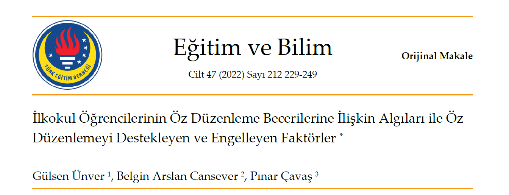

---
## Örnek bir makale;
- Başlık -  Kim, ne zaman, ne yapmış?
- Dipnot

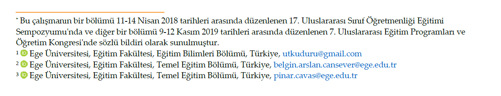


---
## Örnek bir makale;
- Özet-  Bu makale ne hakkındaymış, neler yapılmış?


---
## Örnek bir makale;
-  Giriş - Bu araştırma niçin yapılmış?

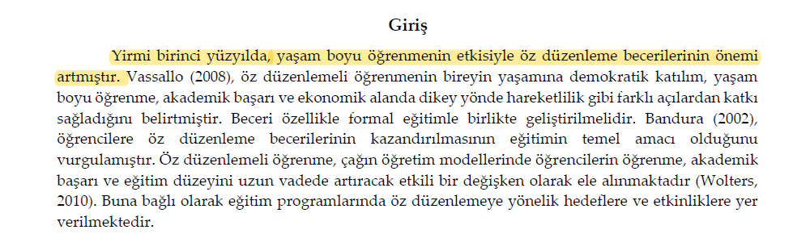


---
## Örnek bir makale;
-  Giriş - Bu araştırma niçin yapılmış?

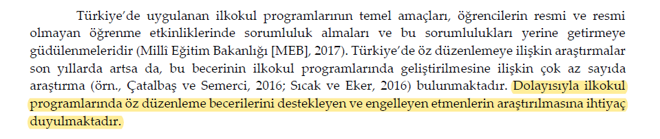

---
## Örnek bir makale;
- Yöntem- Bu araştırma nasıl yapılmış?

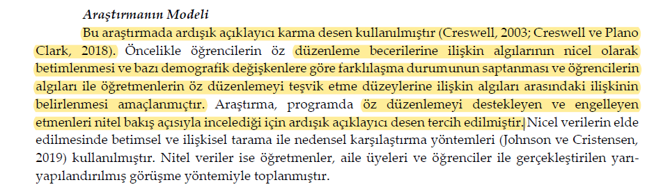


---
## Örnek bir makale;
- Yöntem- Bu araştırma nasıl yapılmış?

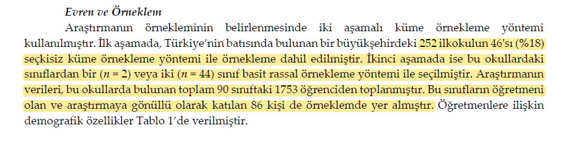

---
## Örnek bir makale;
- Yöntem- Bu araştırma nasıl yapılmış?

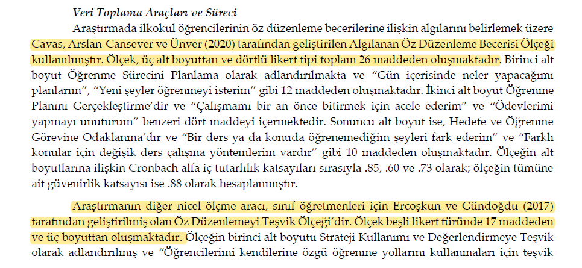

---
## Örnek bir makale;
- Yöntem- Bu araştırma nasıl yapılmış?

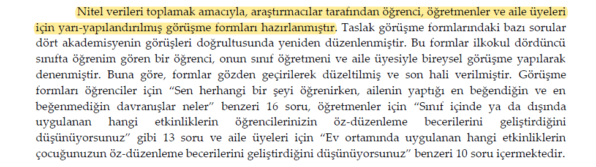


---
## Örnek bir makale;
- Yöntem- Bu araştırma nasıl yapılmış?

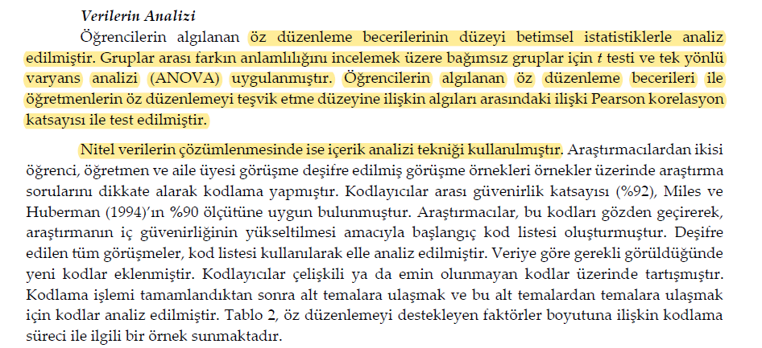

---
## Örnek bir makale;
- Yöntem- Bu araştırma nasıl yapılmış?

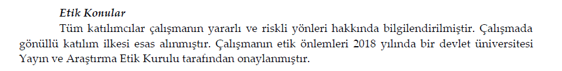

---
## Örnek bir makale;
- Bulgular ve Yorumlar - Bu araştırma sonucunda ne bulunmuş, bunlar nasıl algılanabilir
veya yorumlanabilir?


---
## Örnek bir makale;
- Sonuç ve Öneriler - Bu araştırma sonucunda neler bulunmuş, bu sonuçlara göre neler
yapılmalıdır?

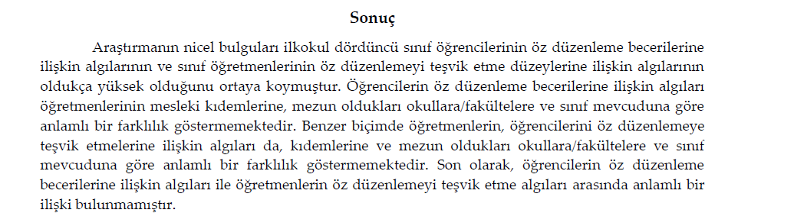


---
## Örnek bir makale;
- Sonuç ve Öneriler - Bu araştırma sonucunda neler bulunmuş, bu sonuçlara göre neler
yapılmalıdır?


---
## Örnek bir makale;
- Sonuç ve Öneriler - Bu araştırma sonucunda neler bulunmuş, bu sonuçlara göre neler
yapılmalıdır?

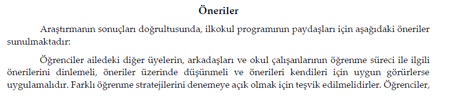

---
## Örnek bir makale;
- Kaynakça

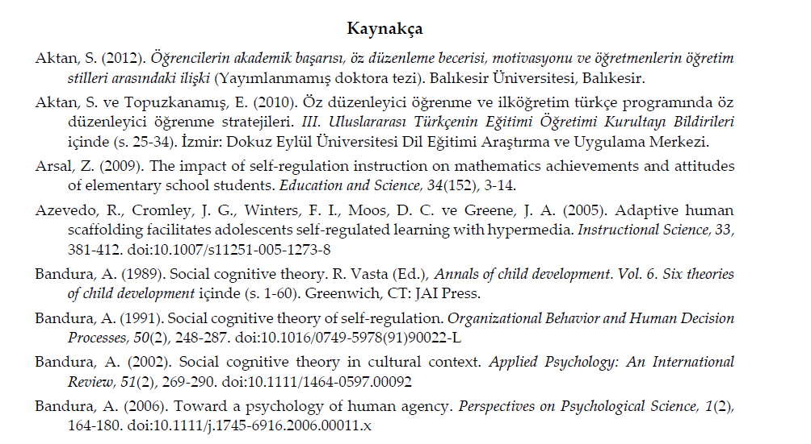

---
## Genel Yazım Kuralları


- `r emo::ji("link")` [Türk Eğitim Derneği (TED) tarafından yayınlanan Eğitim ve Bilim dergisi yazım kuralları](http://egitimvebilim.ted.org.tr/index.php/EB/pages/view/guideForAuthors#writingRules)


 
- `r emo::ji("link")` [APA7 - Akademik Yayın İlkeleri](http://acikders.hacettepe.edu.tr/dersler/edebiyat_fakultesi/APA/APA.html)

- `r emo::ji("link")` [İncelenen Makale](http://egitimvebilim.ted.org.tr/index.php/EB/article/view/11354)

Ünver, G., Arslan Cansever, B., & Çavaş, P. (2022). İlkokul öğrencilerinin öz düzenleme becerilerine ilişkin algıları ile öz düzenlemeyi destekleyen ve engelleyen faktörler. **Eğitim ve Bilim, 47**(212). doi:http://dx.doi.org/10.15390/EB.2022.11354

---


##  .large[.hand[teşekürler]]